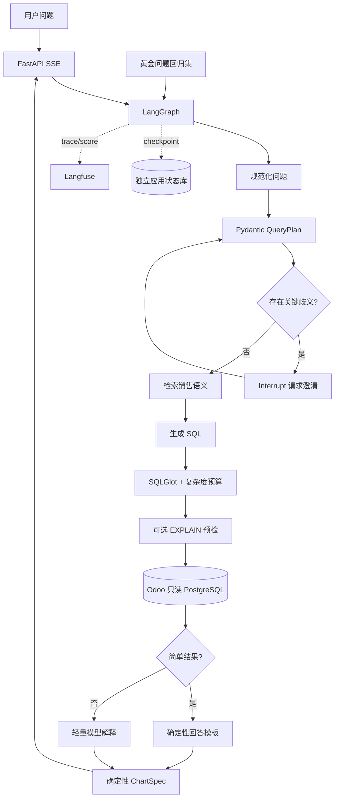

# Odoo Agent 快速强化路线图

> 制定日期：2026-08-06
>
> 当前边界：单用户、单公司、销售分析、Odoo 实时只读、数据量小、功能优先。
>
> 目标：不堆叠第二套 Agent 框架，用最少的新组件迅速提高准确率、可恢复性、可测试性和交互体验。

## 1. 结论先行

外部建议的大方向正确：LangGraph 只负责编排，SQL、安全、模型、观测和评测由专门组件承担。但它没有完全结合当前代码现状，以下能力已经存在，不能再算新增项目：

| 能力 | 当前状态 | 下一步 |
| --- | --- | --- |
| SQLGlot | 已使用 `sqlglot==30.14.0` 做 AST 解析、单语句、只读、表字段白名单、函数限制、公司过滤和 LIMIT | 增加复杂度预算与 `EXPLAIN` 预检 |
| Pydantic | 已用于 FastAPI 请求、响应、设置和图表协议 | 扩展到 LangGraph 内部 QueryPlan/SQLResult 协议 |
| Langfuse | 已覆盖 Agent、Generation、Retriever、Tool、Session、Token、耗时和 Trace 直达链接 | 增加 Cost、用户反馈、Score、Dataset 和实验 |
| 双模型供应商 | DeepSeek 与硅基流动已经可在页面切换 | 改成“按节点选模型”，暂不引入 LiteLLM |
| 业务语义层 | 已有销售指标、开放表字段、SQL 示例和检索 | 先版本化和回归测试，暂不上 Wren/Cube/pgvector |
| 图表安全 | 后端只返回白名单 ChartSpec，前端确定性生成 ECharts | 保持，不让模型输出任意代码 |

当前最值得立刻投入的五件事，按收益排序：

1. 建立黄金问题与 SQL 结果回归测试。
2. 用 Pydantic 固化 LangGraph 内部 QueryPlan，不增加一次额外模型调用。
3. 加 PostgreSQL Checkpointer、持久会话和条件 Interrupt。
4. 加 SSE 步骤流，让用户立即看到当前执行阶段。
5. 按节点选择模型，并让简单结果跳过第二次 LLM 总结。

同时补齐 Langfuse Cost 和点赞/点踩评分。这些工作完成后，再决定是否引入 Instructor、LiteLLM、dbt、pgvector 或 DeepEval。

## 2. 当前最关键的缺口

### 2.1 目前无法量化“改完是否更准”

现有 33 项自动测试覆盖 API、SQL 安全、数据库和基础 Agent 流程，但没有一组真实业务问题对应的参考指标、时间范围、SQL 结果和答案证据。因此更换模型或 Prompt 后，只能靠人工感觉。

### 2.2 模型内部输出仍是手工解析 JSON

SQL 生成结果目前通过 `_json_object()` 提取，只有 `sql` 和 `metric_ids`，缺少经过类型校验的：

- 查询类型；
- 指标、维度和过滤器；
- 时间范围；
- 假设和歧义；
- 展示粒度；
- 是否需要用户澄清。

这会让错误在“SQL 执行失败”时才暴露，而不是在查询计划阶段提前发现。

### 2.3 会话只存在浏览器内

刷新页面、后端重启或节点失败后，LangGraph 无法恢复原状态，也无法实现真正的 Interrupt、历史状态和从断点继续。

### 2.4 用户要等待二十多秒却看不到实时阶段

当前请求一次性返回。Langfuse 已证明数据库通常只需约 0.2 秒，主要耗时来自两次串行模型调用。用户需要先看到“正在生成 SQL / 正在查询 / 正在解释”，而不是面对静止页面。

### 2.5 两次 LLM 调用没有按任务分工

SQL 生成需要强模型；简单 KPI、排名和趋势结果未必需要第二次强模型。当前统一模型会同时放大延迟和成本。

## 3. 快速强化后的目标架构



重要边界：

- Odoo 数据库继续只读，绝不用于保存 Checkpoint。
- Checkpointer 使用单独的 `odoo_agent_state` 数据库或独立 schema/写入账号。
- Checkpoint、Dataset 和 Trace 不保存密钥，不保存不必要的完整业务明细。
- LangGraph 仍是唯一编排层，不引入 CrewAI、AutoGen 或其他 Graph 框架。

## 4. 实施阶段

### 阶段 A：先建立可测基线（最高优先级）

#### A1. 黄金销售问题集

新增：

```text
evals/
├─ datasets/sales_golden.jsonl
├─ run_sales_eval.py
└─ README.md
```

第一批放入 20～30 个真实问题，覆盖：

- KPI：本月销售额、订单数、平均订单额；
- 趋势：今年每月、最近六个月、同比和环比；
- 排名：客户、产品和销售员 Top N；
- 履约：未完全交付、未完全开票；
- 追问：那上个月呢、换成含税、只看某客户；
- 边界：空数据、歧义问题、未知指标、恶意 SQL 指令。

每条记录保存：

```json
{
  "id": "sales-monthly-current-year",
  "question": "今年每个月销售趋势怎么样？",
  "expected": {
    "intent": "data",
    "metric_ids": ["sales_amount"],
    "dimensions": ["month"],
    "time_range_kind": "current_year",
    "must_use_tables": ["sale_order"],
    "result_signature": "month,sales_amount"
  }
}
```

优先使用确定性检查，而不是先上 LLM Judge：

- SQL 是否通过安全校验；
- SQL 是否执行成功；
- 指标、维度、时间范围是否正确；
- 结果列和参考查询是否一致；
- 聚合结果是否在允许误差内；
- 回答中的数字是否来自结果集。

然后把同一批数据同步到 Langfuse Dataset，模型/Prompt 变更前跑 Experiment。Langfuse Dataset 支持保存输入和期望输出，Scores 可关联 Trace、Observation、Session 或 Dataset Run。

#### A2. 用户反馈闭环

在每条回答旁增加：

- 👍 / 👎：Langfuse BOOLEAN Score，固定命名 `user-thumbs`；
- 可选错误原因：`数字不对`、`口径不对`、`没有回答问题`、`太慢`；
- 可选文字备注。

由后端接收反馈并写 Langfuse，Secret Key 不进入浏览器。负反馈 Trace 可以一键加入黄金问题候选集。

#### 阶段 A 验收

- 一条命令能输出总通过率和每项失败原因；
- 当前模型得到第一份基线报告；
- Langfuse 能按 `user-thumbs=0` 筛选错误回答；
- 后续更换模型时不再依赖肉眼判断。

### 阶段 B：固化内部协议，提高 Text2SQL 稳定性

#### B1. 引入内部 Pydantic Contracts

新增 `backend/app/bi/contracts.py`：

```python
class TimeRange(BaseModel):
    kind: Literal["current_month", "previous_month", "current_year", "custom"]
    start: date | None = None
    end: date | None = None

class QueryFilter(BaseModel):
    field: str
    operator: Literal["eq", "in", "gte", "lte", "contains"]
    value: str | int | float | list[str]

class QueryPlan(BaseModel):
    analysis_type: Literal["kpi", "trend", "ranking", "detail", "comparison"]
    metric_ids: list[str]
    dimensions: list[str]
    filters: list[QueryFilter]
    time_range: TimeRange | None
    ambiguity: str | None
    assumptions: list[str]
    sql: str
```

一次模型调用同时返回 QueryPlan 和 SQL，不额外增加 `plan_query` 模型调用。流程改为：

```text
模型 JSON
→ Pydantic model_validate_json
→ 业务白名单校验
→ SQLGlot AST 校验
→ 失败时最多一次结构化修复
```

#### B2. 暂不引入 Instructor

当前只有一个核心结构化生成节点，并且两个供应商都走 OpenAI 兼容 JSON Mode。先使用 Pydantic 原生校验和现有修复回路，减少依赖。

当满足以下任一条件时再引入 Instructor：

- 出现三个以上结构化 LLM 节点；
- 首次结构化解析成功率低于 98%；
- 不同供应商 JSON Mode 差异造成大量适配代码；
- 验证失败重试逻辑开始重复。

#### B3. 强化 SQLGlot，而不是重复引入

在现有 Guard 上补充：

- 最大 JOIN 数；
- 最大子查询/CTE 数；
- 禁止笛卡尔积；
- 明细查询必须有时间范围；
- 聚合与非聚合字段一致性检查；
- SQL 规范化哈希，用于去重和黄金 SQL 比较；
- 对高风险查询执行只读 `EXPLAIN (FORMAT JSON)`，按计划行数或总成本决定是否 Interrupt。

#### 阶段 B 验收

- QueryPlan 首次解析成功率不低于 98%；
- 黄金集指标/维度/时间范围正确率不低于 90%；
- 所有 SQL 继续保持只读安全测试 100% 通过；
- 无法识别的业务歧义不会直接生成猜测 SQL。

### 阶段 C：持久会话与条件 Interrupt

#### C1. PostgreSQL Checkpointer

新增唯一一个近期生产依赖：

```text
langgraph-checkpoint-postgres
```

当前 FastAPI 和 LangGraph 都是异步执行，应使用 `AsyncPostgresSaver`。每个聊天会话使用现有 `session_id` 作为 `thread_id`：

```python
config = {"configurable": {"thread_id": session_id}}
```

LangGraph 官方说明，Checkpointer 会在每个执行步骤保存线程状态，从而支持对话记忆、Interrupt、故障恢复、状态历史和回放。

状态库要求：

- 使用独立数据库或 schema，例如 `odoo_agent_state`；
- 使用独立读写账号；
- 不复用 `codex_readonly`；
- 不写入 `odoo19_dev` 的业务表；
- 大结果集不完整存入状态，只保留受限样本、摘要或结果引用；
- 所有状态保持 JSON 可序列化。

#### C2. 第一批 Interrupt 只处理三类情况

1. 指标歧义：销售额是订单额、开票额还是收款额；
2. 时间范围歧义：用户要求“历史全部”或没有可推断范围的明细查询；
3. 查询成本过大：`EXPLAIN` 超过阈值。

不要对普通问题频繁弹确认。中断必须有明确原因和 2～3 个可选项，用户选择后使用同一个 `thread_id` 恢复。

Interrupt 所在节点在恢复时可能重新执行，所以：

- 中断前不做写操作；
- 外部调用使用幂等键；
- 保存反馈或黄金 SQL 独立成幂等节点；
- SQL 查询允许重复执行，但必须保持只读与超时。

#### C3. 会话 API

新增：

| 方法 | 地址 | 用途 |
| --- | --- | --- |
| `GET` | `/api/conversations` | 会话列表 |
| `GET` | `/api/conversations/{thread_id}` | 当前状态和历史消息 |
| `POST` | `/api/chat/{thread_id}/resume` | 恢复 Interrupt |
| `DELETE` | `/api/conversations/{thread_id}` | 删除本地 Agent 会话状态 |

#### 阶段 C 验收

- 刷新网页后会话仍然存在；
- 后端重启后可以继续同一会话；
- 三类歧义能够暂停、展示选项并恢复；
- 恢复过程中不重复产生副作用；
- Odoo 数据库仍保持只读。

### 阶段 D：SSE 步骤流与体感提速

#### D1. 先流式返回阶段，不急着流式返回每个 Token

新增 `POST /api/chat/stream`，使用 SSE 返回：

```text
accepted
classifying
checking_database
retrieving_semantics
generating_sql
validating_sql
executing_sql
summarizing
completed / interrupted / failed
```

第一版的价值是让用户在 200～500ms 内看到工作开始，并知道慢在哪一步。第二版再加入模型 Token 流，以免同时改动模型网关、前端渲染和 Langfuse Generation 收尾逻辑。

#### D2. 简单结果使用确定性回答模板

这些情况默认不再调用第二次模型：

- 单个 KPI；
- 单维度 Top N；
- 简单月度趋势；
- 空结果；
- 已有固定口径的订单计数。

程序根据真实结果生成短结论，复杂比较、多指标解释和异常洞察才调用 `explain-sales-result`。预计可直接省掉当前约 6 秒的第二次模型调用，并减少输出 Token 成本。

#### 阶段 D 验收

- 用户提交后 500ms 内出现第一个阶段事件；
- 每一步状态与 Langfuse Observation 对应；
- 简单问题只调用一次 LLM；
- 数据问题 p50 从当前约 23～24 秒下降到 18 秒以内；
- 前端断线后能通过 `thread_id` 查询最终状态。

### 阶段 E：按节点模型路由，暂不上 LiteLLM

当前自建 `LLMGateway` 已支持 DeepSeek 和硅基流动。近期先增加节点级配置：

```text
SQL_LLM_PROVIDER / SQL_LLM_MODEL
ANSWER_LLM_PROVIDER / ANSWER_LLM_MODEL
REPAIR_LLM_PROVIDER / REPAIR_LLM_MODEL
JUDGE_LLM_PROVIDER / JUDGE_LLM_MODEL
```

建议分工：

| 节点 | 模型策略 |
| --- | --- |
| SQL 生成 | 能力最稳定的模型 |
| SQL 修复 | 同 SQL 模型或备用强模型 |
| 结果解释 | 更快、更便宜的模型 |
| 普通聊天 | 快速模型 |
| 离线 Judge | 与被测模型不同的模型 |

先在薄网关中实现：

- 超时、限流和服务错误的统一分类；
- 仅对可重试错误重试；
- Provider/Model fallback；
- 每个节点独立超时；
- Generation metadata 记录逻辑角色、首选模型和是否降级。

满足以下条件再引入 LiteLLM：

- 接入三个以上供应商；
- 多个应用需要共用模型网关；
- 需要集中预算、虚拟 Key、限流或负载均衡；
- 自建 fallback/异常适配代码明显膨胀。

LiteLLM 官方提供统一 OpenAI 格式、Router 重试/fallback 和 Proxy 预算管理，但当前单应用、两个 OpenAI 兼容供应商还不足以抵消新增服务和排错层的成本。

#### 阶段 E 验收

- 页面可分别选择 SQL 模型和回答模型；
- 模拟首选 Provider 超时后可以自动降级；
- Langfuse 能按 `generation_role` 和模型比较准确率、延迟、Token 与 Cost；
- 降级不会绕过 SQL 安全校验。

## 5. 暂缓引入的产品及触发条件

| 产品/技术 | 当前决定 | 真正触发条件 |
| --- | --- | --- |
| Instructor | 暂缓 | 三个以上结构化 LLM 节点或首次解析成功率低于 98% |
| LiteLLM | 暂缓 | 三个以上供应商、多个应用共享网关或需要集中预算/限流 |
| dbt Core | 暂缓 | 出现稳定的 `analytics.bi_*` 视图、重复复杂 JOIN 或多个消费者共用数据模型 |
| pgvector | 暂缓 | 已人工确认 50 条以上黄金问题/SQL，关键词检索明显不足 |
| DeepEval | 阶段 A 后评估 | 确定性回归完善后，需要节点级或多轮 LLM Judge |
| Ragas | 暂缓 | 真正加入文档 RAG、向量检索和 Context 评测 |
| Promptfoo | 阶段 B 后做一次安全冒烟 | API 准备上线，或加入持久 Memory、MCP、外部文档 RAG、写操作 |
| MCP | 暂缓 | 需要让 ChatGPT、Claude、IDE 等外部客户端调用业务级工具 |
| Wren AI | 暂缓 | 扩展到销售、采购、库存、发票、收款、毛利等多主题复杂关联 |
| Cube | 暂缓 | Agent、看板和其他 BI 工具必须共享同一指标 API |
| Redis/RedisVL | 暂缓 | 并发、成本或延迟成为瓶颈，并且已有可靠数据版本缓存键 |
| Temporal | 暂缓 | 出现跨小时/跨天的同步、dbt、审批、日报或通知工作流 |
| Guardrails AI | 暂缓 | 出现 PII、权限、多用户或写操作等复杂 Validator 需求 |

### 为什么 dbt 目前不进入 P0

当前项目直接实时查询少量 Odoo 销售表，没有已经稳定存在的 `analytics.bi_*` 数据模型。此时引入 dbt 会先增加一个建模、运行和部署层，却未必提升当前 Text2SQL 正确率。

当重复 JOIN、履约/开票逻辑和跨主题指标增多时，再让 dbt Core 管理 staging/marts、数据测试和文档，价值会明显高于成本。

### 为什么 pgvector 目前不进入 P0

黄金案例太少时，向量检索只会召回未经充分验证的 SQL。先积累人工确认和回归通过的案例，当前关键词与规则检索足够、也更容易解释。

## 6. 推荐实施顺序与工作量

| 顺序 | 工作包 | 预估 | 新生产依赖 | 主要收益 |
| --- | --- | ---: | --- | --- |
| 1 | 黄金集、确定性回归、Langfuse Feedback/Score | 1～2 轮开发 | 无 | 从“感觉正确”变成可度量 |
| 2 | Pydantic QueryPlan + SQLGlot 复杂度规则 | 1～2 轮开发 | 无 | 提前发现语义与 SQL 错误 |
| 3 | Checkpointer + Interrupt + 会话 API | 2～3 轮开发 | `langgraph-checkpoint-postgres` | 可恢复、可澄清、可续跑 |
| 4 | SSE 步骤流 + 确定性简单回答 | 1～2 轮开发 | 无 | 体感和实际延迟明显下降 |
| 5 | 节点级模型路由与 fallback | 1～2 轮开发 | 无 | 降成本、降延迟、提高可用性 |
| 6 | DeepEval/Promptfoo 小规模试点 | 基线完成后 | 仅开发依赖 | 质量回归与安全冒烟 |

不要在同一轮同时引入 Checkpointer、LiteLLM、Instructor、dbt 和 pgvector。每次只改变一层，并使用同一黄金集对比前后结果。

## 7. 总体验收指标

| 指标 | 当前 | 强化后目标 |
| --- | --- | --- |
| SQL 安全测试 | 已覆盖 | 100% 通过，增加复杂度/EXPLAIN 测试 |
| 黄金问题数量 | 0 | 首批 20～30，逐步达到 50 |
| QueryPlan 首次解析成功率 | 未统计 | ≥ 98% |
| 指标/维度/时间范围正确率 | 未统计 | ≥ 90% |
| 数据问题 p50 | 约 23～24 秒，小样本 | ≤ 18 秒 |
| 简单问题 LLM 调用次数 | 通常 2 次 | 1 次 |
| 会话恢复 | 不支持 | 刷新/重启后可恢复 |
| Interrupt | 不支持 | 三类关键歧义可暂停恢复 |
| 用户反馈 | 不支持 | Score 与 Trace 正确关联 |
| Cost | Token 已有，Cost 为 0 | 新 Generation 100% 有模型价格与 Cost |

## 8. 第一轮建议直接执行的范围

第一轮只做以下内容：

1. 创建 20 条黄金销售问题；
2. 建立确定性评测运行器和报告；
3. 新增 QueryPlan/Filter/TimeRange Pydantic 模型；
4. 让当前 SQL 生成一次性返回 QueryPlan + SQL；
5. 增加复杂度规则和相关测试；
6. 在聊天回答上增加 👍/👎，写入 Langfuse `user-thumbs` Score；
7. 在 Langfuse 配置当前 DeepSeek 模型价格，使新 Trace 出现 Cost。

第一轮明确不做：React 重构、dbt、pgvector、LiteLLM、Instructor、DeepEval、Ragas、MCP、Wren、Cube、Redis、Temporal。

完成第一轮后，根据黄金集结果再决定第二轮优先做 Checkpointer/Interrupt，还是先做 SSE/模型路由。

## 9. 官方参考

- [LangGraph Persistence](https://docs.langchain.com/oss/python/langgraph/persistence)
- [LangGraph Interrupts](https://docs.langchain.com/oss/python/langgraph/interrupts)
- [LangGraph Event Streaming](https://docs.langchain.com/oss/python/langgraph/event-streaming)
- [LangGraph Checkpointer Integrations](https://docs.langchain.com/oss/python/integrations/checkpointers/index)
- [Langfuse User Feedback](https://langfuse.com/docs/observability/features/user-feedback)
- [Langfuse Scores](https://langfuse.com/docs/evaluation/scores/overview)
- [Langfuse Datasets](https://langfuse.com/docs/evaluation/experiments/datasets)
- [Langfuse Evaluation Concepts](https://langfuse.com/docs/evaluation/core-concepts)
- [LiteLLM 官方文档](https://docs.litellm.ai/)
- [dbt Developer Hub](https://docs.getdbt.com/)
- [Promptfoo Agent Red Teaming](https://www.promptfoo.dev/docs/red-team/agents/)
- [SQLGlot](https://github.com/tobymao/sqlglot)
- [pgvector](https://github.com/pgvector/pgvector)
