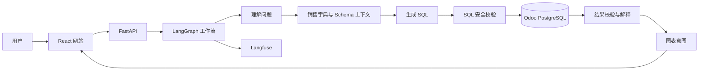

# Odoo 销售数据 Agent 项目规划

> 当前阶段：单用户、本地开发、单公司、销售分析、只读、少量数据。  
> 核心目标：先把“自然语言提问 → 实时查询 Odoo → 返回可信结论和图表”完整跑通。

## 当前实施状态（2026-08-06）

首个功能闭环已经完成：

- Odoo `odoo19_dev` 已通过 `codex_readonly` 实时只读接入，默认限定公司 ID 1。
- 销售语义层、9 张开放表、71 个开放字段和首批指标口径已经落地。
- LangGraph 已实现普通问答、指标解释、SQL 生成、安全校验、最多两次修复、只读执行和结果解释。
- 聊天页已经展示真实结果表格、本地 ECharts 6.1.0 图表、查询耗时和可折叠 SQL。
- 工作台与销售看板已移除演示数字，直接汇总 Odoo 真实销售订单；支持周/月/季度、销售员、客户、产品、状态、交付/开票待办和 CSV 导出。
- “数据与模型”页的销售指标、开放表和查询限制均由后端实时读取，不再维护静态演示清单。
- Langfuse 已从根 Agent 到模型、检索、校验和数据库工具完整记录 Trace。

当前前端继续使用静态 HTML/CSS/JavaScript 快速验证功能；React、SSE、会话持久化和 Ragas 仍属于后续工作。

## 1. 已确定的技术方向

| 范围 | 选择 | 说明 |
| --- | --- | --- |
| 前端 | React + TypeScript + Vite | 单页网站，承载对话、表格、图表和设置 |
| 图表 | Apache ECharts | 不再使用 Metabase，所有图表由网站直接渲染 |
| 后端 | FastAPI | 提供流式对话、数据查询、配置和反馈接口 |
| Agent 编排 | LangGraph | 使用固定、可观察的工作流，不做完全自由的 Agent |
| 主模型 | DeepSeek API | 第一优先模型服务 |
| 备用模型服务 | 硅基流动 | 通过 OpenAI 兼容接口切换模型 |
| 数据源 | Odoo 19 PostgreSQL | 第一阶段直接实时读取，只使用只读连接 |
| SQL 校验 | SQLGlot + 数据库只读账号 | 双重限制，避免误写和危险查询 |
| 可观测性 | Langfuse | 从项目第一天接入，记录完整 Agent 调用链 |
| RAG | 暂不引入 LlamaIndex | 初期表少，使用静态业务字典和 SQL 示例更简单可靠 |
| 评测 | 后续接入 Ragas | 积累 30～50 个标准问题后开始自动回归 |

## 2. 第一阶段目标

用户能够直接询问：

- 本月销售额是多少？
- 本月比上月增长多少？
- 销售额最高的十个客户是谁？
- 销量最高的产品是什么？
- 最近六个月的销售趋势如何？
- 各销售员的销售额排名如何？
- 哪些订单已经确认但没有完全交付？
- 哪些订单已经交付但没有完全开票？
- 总结一下本月销售情况。

系统返回：

1. 简短业务结论。
2. 指标口径和时间范围。
3. 查询结果表格。
4. 自动选择的 ECharts 图表。
5. 可折叠查看的 SQL。
6. 查询耗时、返回行数和必要警告。
7. 推荐的后续问题。

## 3. 第一阶段暂不做

- 不接入 Odoo 用户体系。
- 不处理多用户、角色和行级权限。
- 不写回 Odoo，不创建或修改业务单据。
- 不建设数据仓库和复杂 ETL。
- 不做多公司隔离。
- 不优先考虑高并发和大数据量。
- 不做通用的全库问数，先限定在销售领域。
- 不让模型生成任意 JavaScript 或完整 ECharts Option。

## 4. 总体架构



核心原则：

- Odoo 数据库只负责提供业务数据。
- LangGraph 负责控制执行步骤和错误修复。
- FastAPI 负责执行 SQL、转换数据和生成安全的响应结构。
- React 根据后端的图表意图生成 ECharts 配置。
- Langfuse 记录从用户问题到最终回答的整条链路。

## 5. 为什么直接使用 ECharts

当前项目不需要 Metabase 的自助查询、权限、仪表盘管理和分享能力，直接使用 ECharts 更合适：

- 页面风格可以完全统一。
- 对话结果可以立即转成图表，不需要创建 Metabase Question。
- 图表可以和 SQL、解释、追问放在同一个结果卡片里。
- 减少一个独立服务和一套元数据管理。
- 后续可以实现“切换图表”“保存分析”“导出图片”等交互。

### 5.1 图表安全边界

模型只输出图表意图，不输出任意代码：

```json
{
  "type": "line",
  "title": "近 6 个月销售趋势",
  "x_field": "month",
  "y_fields": ["sales_amount"],
  "series_names": ["销售额"],
  "value_format": "currency"
}
```

前端的 `ChartRenderer` 根据白名单类型生成 ECharts Option。

第一版支持：

- `kpi`：单个关键指标。
- `line`：时间趋势。
- `bar`：分类比较。
- `horizontal_bar`：客户、产品排行。
- `pie`：少量状态占比。
- `table`：明细或不适合绘图的数据。

选择规则：

- 一个数值：KPI。
- 时间字段 + 数值：折线图。
- 分类字段 + 数值：柱状图。
- 排名前 N：横向柱状图。
- 2～6 个互斥类别：饼图。
- 明细、多字段或类别过多：表格。

## 6. LangGraph 工作流

第一版使用明确的固定流程：

```text
接收问题
  ↓
识别意图、指标、维度、过滤条件、时间范围
  ↓
加载相关销售表结构、指标定义和 SQL 示例
  ↓
判断是否需要向用户澄清
  ↓
生成 SQL
  ↓
SQLGlot 解析和安全校验
  ↓
执行只读查询
  ↓
结果为空或 SQL 报错时最多自动修复两次
  ↓
生成业务解释和图表意图
  ↓
返回流式响应
```

建议节点：

1. `normalize_question`
2. `classify_intent`
3. `load_sales_context`
4. `plan_query`
5. `generate_sql`
6. `validate_sql`
7. `execute_sql`
8. `repair_sql`
9. `analyze_result`
10. `plan_chart`
11. `compose_answer`

状态中只保存结构化数据，例如：

```python
class AgentState(TypedDict):
    question: str
    intent: dict
    metric_context: list[dict]
    sql: str | None
    sql_attempts: int
    columns: list[str]
    rows: list[dict]
    chart: dict | None
    answer: str | None
    warnings: list[str]
```

## 7. 模型服务设计

DeepSeek 和硅基流动都放在统一的模型适配层后面：

```text
Agent
  ↓
ModelGateway
  ├─ DeepSeekProvider
  └─ SiliconFlowProvider
```

模型配置从环境变量读取：

```text
LLM_PROVIDER
LLM_BASE_URL
LLM_API_KEY
LLM_MODEL
LLM_TIMEOUT_SECONDS
LLM_MAX_RETRIES
```

代码不能依赖某个固定模型名称。每个模型配置还应记录：

```yaml
supports_json_mode: true
supports_tool_calling: true
supports_reasoning_content: false
```

无论供应商是否声明支持 JSON Mode，模型输出都必须经过 Pydantic 校验。

## 8. Odoo 销售数据范围

第一批开放表：

- `sale_order`
- `sale_order_line`
- `res_partner`
- `res_users`
- `product_product`
- `product_template`
- `res_currency`
- `res_company`

第二批按实际需要增加：

- `stock_picking`
- `stock_move`
- `account_move`
- `account_move_line`

模型不会看到整个 Odoo Schema，只接收当前问题相关的字段说明。

### 8.1 默认销售口径

第一版建议采用：

```text
销售额 = SUM(sale_order.amount_untaxed)
订单状态 = sale 或 done
时间字段 = sale_order.date_order
时区 = Asia/Shanghai
币种 = 公司默认币种
```

注意：该指标表示已确认销售订单的未税金额，不等同于财务开票收入，也不等同于实际收款金额。

后续单独增加：

- 已开票收入。
- 已收款金额。
- 已交付金额。
- 待交付金额。
- 待开票金额。

## 9. 业务字典

初期不使用向量数据库，业务定义以 YAML 文件管理：

```yaml
metrics:
  sales_amount:
    name: 销售额
    description: 已确认销售订单的未税金额
    source_table: sale_order
    expression: SUM(amount_untaxed)
    states: [sale, done]
    date_field: date_order
    synonyms: [销售额, 销售收入, 订单金额, 营收]
    default_chart: line
```

业务字典至少包含：

- 指标定义。
- 中文字段名称。
- 表关联关系。
- 状态值含义。
- 默认时间字段。
- 同义词。
- 正确 SQL 示例。
- 常见错误说明。

当字典、文档和示例明显增多后，再引入 LlamaIndex 和向量检索。

## 10. SQL 安全与执行

即使当前只有一个用户，也保留最基本的数据库保护：

- 使用独立只读数据库连接。
- 只允许单条 `SELECT` 或 `WITH ... SELECT`。
- 禁止 DDL、DML、`COPY` 和多语句。
- 只允许访问白名单表。
- 默认最大返回 500 行。
- 查询超时默认 15 秒。
- SQL 修复最多两次。
- 数据库连接信息只保存在环境变量中。
- 浏览器不能直接访问 PostgreSQL。

SQL 校验分为两层：

1. SQLGlot 解析 SQL AST，拒绝非只读语句和非白名单表。
2. PostgreSQL 账号本身只有读取权限。

## 11. API 设计

建议第一版提供：

| 方法 | 地址 | 用途 |
| --- | --- | --- |
| `GET` | `/api/health` | 后端、数据库、模型和 Langfuse 状态 |
| `POST` | `/api/chat/stream` | 发起问题并通过 SSE 返回执行进度与答案 |
| `GET` | `/api/conversations` | 获取本地会话列表 |
| `GET` | `/api/conversations/{id}` | 获取会话消息 |
| `POST` | `/api/feedback` | 点赞、点踩和错误说明 |
| `GET` | `/api/metrics` | 获取销售指标字典 |
| `GET` | `/api/schema/sales` | 获取开放的销售字段 |
| `POST` | `/api/settings/model/test` | 测试模型连接 |
| `POST` | `/api/settings/database/test` | 测试只读数据库连接 |

### 11.1 对话最终响应结构

```json
{
  "conversation_id": "uuid",
  "message_id": "uuid",
  "answer": "本月销售额为 86,420 元，环比增长 12.8%。",
  "metric": {
    "name": "销售额",
    "definition": "已确认销售订单的未税金额"
  },
  "time_range": {
    "start": "2026-08-01",
    "end": "2026-08-31"
  },
  "sql": "SELECT ...",
  "columns": ["month", "sales_amount"],
  "rows": [],
  "chart": {
    "type": "line",
    "x_field": "month",
    "y_fields": ["sales_amount"]
  },
  "warnings": [],
  "trace_id": "langfuse-trace-id"
}
```

## 12. Langfuse 从第一天接入

建议从项目初始化时就加入 Langfuse，而不是等功能完成后补埋点。原因是早期最需要知道：

- 模型为什么生成了错误 SQL。
- 给模型提供了哪些 Schema 和指标定义。
- SQL 在哪个步骤被拒绝或修复。
- 每次请求调用了多少次模型。
- 哪个 Prompt 版本效果更好。
- 延迟主要发生在模型还是数据库。

### 12.1 接入原则

- Langfuse 失败不能导致主请求失败。
- 通过 `LANGFUSE_ENABLED` 控制是否启用。
- 开发、测试和正式环境分别打标签。
- Prompt 必须有名称和版本。
- 每个用户问题对应一个 Trace。
- 同一聊天中的多个 Trace 使用同一个 `session_id` 归组。
- LangGraph 的重要节点对应独立 Span。
- 所有反馈关联到原 Trace。

建议环境变量：

```text
LANGFUSE_ENABLED
LANGFUSE_BASE_URL
LANGFUSE_PUBLIC_KEY
LANGFUSE_SECRET_KEY
LANGFUSE_TRACING_ENVIRONMENT
LANGFUSE_TRACING_ENABLED
LANGFUSE_RELEASE
```

这些变量只列名称，不在仓库中保存真实值。

### 12.2 Trace 结构

```text
answer-sales-question (agent)
├─ normalize-question (span)
├─ classify-intent (span)
├─ retrieve-sales-schema (retriever)
├─ plan-query (generation)
├─ generate-sales-sql (generation)
├─ validate-read-only-sql (tool)
├─ execute-read-only-sql (tool)
├─ repair-sales-sql (generation，可选)
├─ analyze-query-result (generation)
├─ plan-chart (chain)
└─ compose-answer (generation)
```

Trace 记录：

- 会话 ID、消息 ID。
- 当前环境和代码版本。
- 模型供应商、模型名和 Prompt 版本。
- 输入/输出 Token、耗时、重试次数。
- 提供给模型的表和指标列表。
- 生成的 SQL 和校验结果。
- 数据库执行时间和返回行数。
- 最终图表类型。
- 用户反馈。
- 错误类型，不仅记录错误文本。

不要记录：

- API Key、数据库密码和连接字符串。
- 不必要的完整数据库明细。
- 受保护的配置文件内容。

当前业务数据安全要求不高，可以记录 SQL、聚合结果和少量结果样本，但仍应限制单次样本行数。

### 12.3 部署选择

项目开始时可以先选择其中一种：

1. **Langfuse Cloud**：启动最简单，适合单人快速开发。
2. **本地自托管 Langfuse**：数据完全留在本地，但会增加 Docker、数据库和升级维护工作。

无论选哪种，应用层都使用相同的 Langfuse/OpenTelemetry 接入方式，后续可以切换 Host。

## 13. 前端页面

第一版保留四个页面：

### 13.1 工作台

- 本月销售额、订单数、平均订单额、待交付订单。
- 最近销售趋势。
- 常用问题入口。
- 最近销售订单。
- 数据库、模型和 Langfuse 状态。

### 13.2 智能问数

- 多轮对话。
- LangGraph 当前执行步骤。
- 结论、口径、表格和 ECharts 图表。
- SQL 展开。
- 复制、重新生成、点赞和点踩。
- 推荐追问。

### 13.3 销售看板

- 周、月、季度切换。
- 销售趋势。
- 客户排行。
- 产品排行。
- 订单状态分布。
- 交付与开票提醒。
- 点击图表后发起相关追问。

### 13.4 数据与模型

- DeepSeek/硅基流动切换。
- 模型连接测试。
- 数据库连接测试。
- 开放表配置。
- 指标字典维护。
- 查询限制配置。
- Langfuse 连接与采集开关。

## 14. 推荐目录结构

```text
odoo-agent/
├─ frontend/
│  ├─ src/
│  │  ├─ api/
│  │  ├─ components/
│  │  │  ├─ chat/
│  │  │  ├─ charts/
│  │  │  └─ tables/
│  │  ├─ pages/
│  │  ├─ stores/
│  │  └─ types/
│  └─ package.json
├─ backend/
│  ├─ app/
│  │  ├─ api/
│  │  ├─ agent/
│  │  │  ├─ graph.py
│  │  │  ├─ state.py
│  │  │  ├─ nodes/
│  │  │  └─ prompts/
│  │  ├─ charts/
│  │  ├─ config/
│  │  ├─ db/
│  │  ├─ llm/
│  │  ├─ observability/
│  │  ├─ schemas/
│  │  └─ services/
│  ├─ tests/
│  └─ pyproject.toml
├─ knowledge/
│  ├─ metrics/sales.yml
│  ├─ schema/sales.yml
│  └─ examples/sales_queries.yml
├─ evals/
│  ├─ datasets/
│  └─ results/
├─ prototype/
│  └─ 静态演示页面
├─ docs/
├─ .env.example
├─ docker-compose.yml
└─ README.md
```

现有静态 HTML 可以继续作为 UI 参考，正式开发时再迁入 `prototype/`，当前不需要立即移动。

## 15. 分阶段实施

### 阶段 0：数据和口径确认

- 核实 Odoo 19 实际销售表字段。
- 检查订单状态和示例数据。
- 手写前 10 个问题的正确 SQL。
- 建立第一版 `sales.yml`。
- 确认销售额口径和币种处理。

完成标准：不依赖模型也能通过 SQL 正确回答首批问题。

### 阶段 1：后端骨架和 Langfuse

- 初始化 FastAPI。
- 建立配置管理和健康检查。
- 接入 DeepSeek/硅基流动适配层。
- 初始化 LangGraph。
- 从第一条请求开始接入 Langfuse Trace 和 Span。
- 建立统一错误类型。

完成标准：能够调用模型，并在 Langfuse 中看到完整测试 Trace。

### 阶段 2：Text2SQL 闭环

- 加载销售字段和指标字典。
- 实现 SQL 生成。
- 实现 SQLGlot 校验。
- 接入只读 Odoo 数据库。
- 实现错误修复回路。
- 保存每次 SQL 和执行结果元数据。

完成标准：首批 10 个问题中至少 8 个能够稳定得到正确结果。

### 阶段 3：React + ECharts

- 将静态原型转换成 React 页面。
- 实现 SSE 流式响应。
- 实现结果表格和 `ChartRenderer`。
- 实现 KPI、折线图、柱状图、横向柱状图和饼图。
- 实现 SQL 展开和用户反馈。

完成标准：从网页提问能够看到完整执行过程、结论、表格和图表。

### 阶段 4：稳定性与评测

- 积累至少 30～50 个真实问题。
- 增加 SQL 执行结果对比测试。
- 接入 Ragas 离线评测。
- 在 Langfuse 中比较 Prompt 和模型版本。
- 增加空结果、歧义问题和错误 SQL 测试。

完成标准：模型或 Prompt 更新前可以自动跑回归测试。

## 16. 第一版验收标准

- DeepSeek 和硅基流动可以通过配置切换。
- 全流程只读，不能修改 Odoo 数据。
- 首批销售问题可以正确生成并执行 SQL。
- SQL 错误可以自动修复，最多两次。
- 每个回答显示业务口径、时间范围和 SQL。
- ECharts 图表类型与数据形状匹配。
- 图表配置不允许执行模型生成的任意代码。
- Langfuse 能看到完整 Trace、模型调用、SQL 校验和数据库执行耗时。
- Langfuse 不可用时，问数功能仍然正常。
- 不在代码、日志或 Trace 中保存密钥和数据库密码。

## 17. 已确认的当前配置

```text
销售额：状态为 sale/done 的销售订单未税金额
币种：公司默认币种；当前公司为 USD，不做跨币种换算
Langfuse：欧洲区 Cloud，保留切换 Base URL 的能力
会话历史：当前仅保存在浏览器会话内，尚未持久化
```

## 18. 参考文档

- [Apache ECharts](https://echarts.apache.org/)
- [LangGraph](https://docs.langchain.com/oss/python/langgraph/overview)
- [Langfuse Observability](https://langfuse.com/docs/observability/overview)
- [DeepSeek API](https://api-docs.deepseek.com/)
- [SiliconFlow API](https://docs.siliconflow.com/en/userguide/quickstart)
