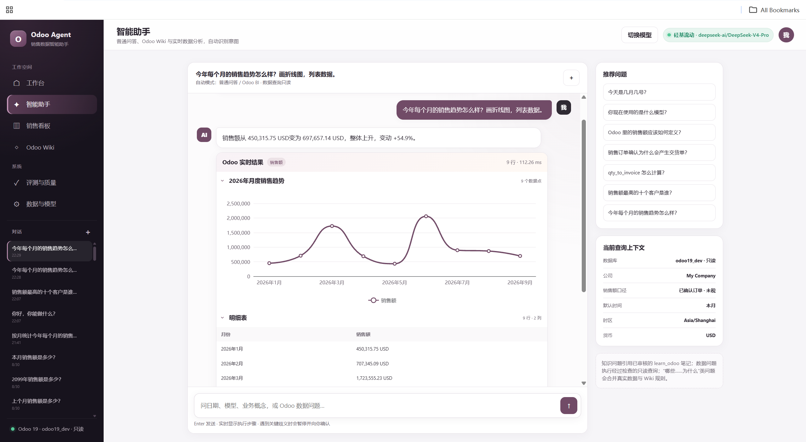
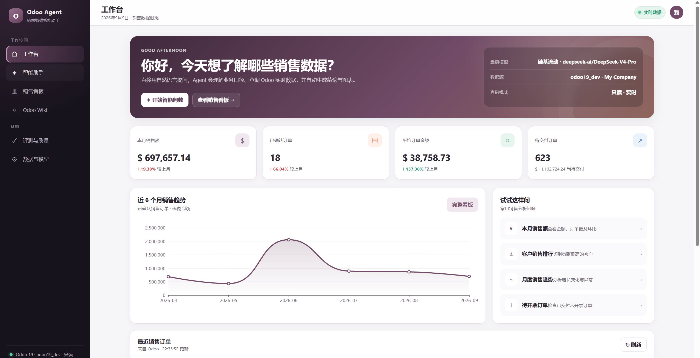
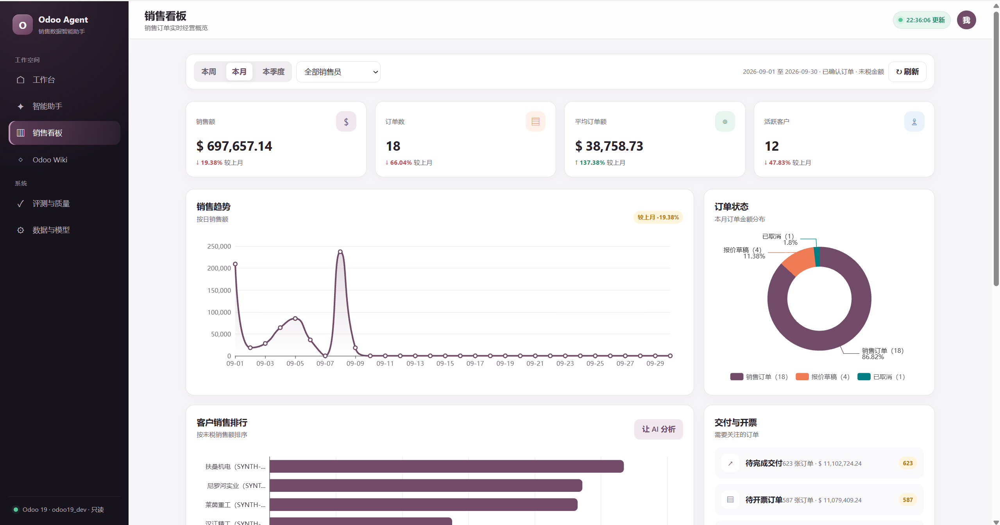
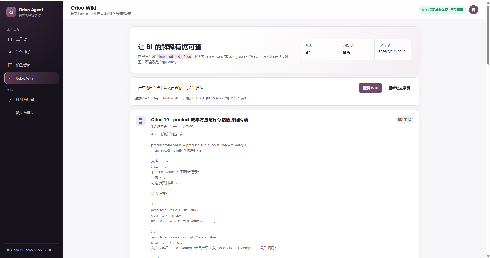
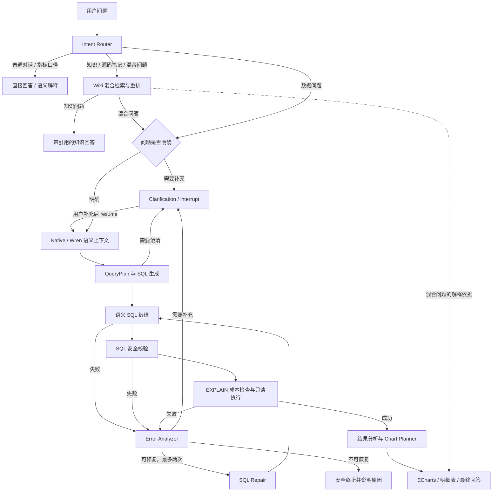

# Odoo Agent

**用自然语言查询 Odoo 销售数据，让结论有数据、解释有出处。**

Odoo Agent 是面向 **Odoo 19** 的只读销售分析与知识助手。你可以直接问“今年每个月的销售趋势怎么样？”，得到实时查询结果、文字分析、明细表和 ECharts 图表；也可以追问业务规则，从已审核的 Odoo Wiki 笔记中查找依据。

项目将 **ChatBI、销售看板和 Wiki RAG** 放在同一个工作台中，通过 LangGraph 管理意图分流、SQL 校验与修复、用户澄清和会话恢复。目前聚焦单用户、单公司、销售分析场景。

[快速开始](#快速开始) · [界面预览](#界面预览) · [工作流与技术栈](#工作流与技术栈) · [评测记录](#评测记录) · [完整文档](docs/README.md)



## 可以用它做什么

| 场景 | 示例问题 / 操作 | 返回内容 |
| --- | --- | --- |
| 自然语言问数 | 今年每个月的销售趋势怎么样？画折线图，列出数据。 | 只读 SQL 查询、趋势分析、图表与明细 |
| 销售排名 | 销售额最高的十个客户是谁？ | 排名、金额、条形图，可查看执行 SQL |
| 经营概览 | 查看本月销售额、订单数、平均订单额和活跃客户 | 固定销售看板，支持时间范围与销售员筛选 |
| 业务知识问答 | 销售订单确认为什么会产生交货单？`qty_to_invoice` 怎么计算？ | 已审核 Wiki 的相关段落、章节引用与笔记链接 |
| 数据与知识结合 | 查询待开票订单，并解释相关业务规则 | 实时数据结果，加上 Wiki 支持的业务解释 |
| 澄清与继续 | 客户名称存在歧义，或问题缺少必要条件 | 暂停询问，用户补充后从同一会话恢复 |

### 核心能力

- **可追溯的问数过程**：结构化 QueryPlan 描述查询意图，界面通过 SSE 展示执行步骤；回答可附带 SQL、查询上下文、数据表及 CSV 导出。
- **有分支的 Agent 工作流**：SQL 失败进入错误分析，允许修复的错误最多重试两次；无法安全处理时停止。歧义问题通过 LangGraph `interrupt()` 等待用户补充。
- **受约束的图表规划**：Chart Planner 结合数据结构生成 Pydantic 校验的 ChartPlan，由前端转换为 ECharts option；支持 KPI、表格、折线、柱形、饼图和散点图，以及排序、Top N。
- **业务语义与 SQL 防护**：Native / Wren 语义层可切换，叠加 SQLGlot AST 白名单、公司条件、行数限制、复杂度检查、EXPLAIN 成本门限、查询超时和只读事务。
- **带引用的 Wiki 检索**：LlamaIndex + FAISS 向量检索，结合 SQLite FTS5/BM25 词法检索、RRF 排名融合和硅基流动 reranker；服务不可用时提供降级结果与原因。
- **模型与质量可观察**：LiteLLM 对接 DeepSeek / 硅基流动，按 SQL、分析回答、普通对话角色选择模型；可选 Langfuse 记录链路、Prompt 版本、Token、估算成本和评测结果。

## 界面预览

以下是项目界面截图，展示交互与呈现方式；其中的数据、模型名称和索引数量对应截图时的环境，不代表新安装后的默认状态或评测成绩。

### 工作台

销售概览、近期趋势、最近订单和常用问题入口。



<details>
<summary>查看销售看板</summary>

按时间范围与销售员筛选，查看销售趋势、订单状态、客户排名，以及交付与开票情况。



</details>

<details>
<summary>查看 Odoo Wiki</summary>

检索已审核的业务与源码学习笔记，查看知识片段及引用；在本机配置好 Obsidian 后，可从链接打开原笔记。



</details>

应用还提供“评测与质量”和“数据与模型”页面，用于查看本地评测报告、模型路由、数据源和可选集成的状态。

## 工作流与技术栈

下面是主要处理路径的简化示意，完整节点与状态定义见 [LangGraph 工作流](docs/07-langgraph-workflow.md)。



| 层次 | 实现 | 在项目中的作用 |
| --- | --- | --- |
| 前端 | 原生 HTML / CSS / JavaScript、ECharts | 工作台、对话、图表、Wiki、设置和质量页面，无需 npm 构建 |
| API | Python 3.12、FastAPI、SSE | 接口、流式步骤和前端静态资源服务 |
| 工作流 | LangGraph `StateGraph`、conditional edges | 意图分流、失败修复、澄清暂停与恢复 |
| 会话与状态 | PostgreSQL Checkpointer / 内存回退 | 独立状态库持久化；未配置时使用进程内状态 |
| 模型接入 | LiteLLM、DeepSeek、硅基流动 | 按节点职责路由模型，结构化生成与用量记录 |
| 业务语义 | Native 销售语义层 / Wren MDL | 业务口径、Schema 上下文与 SQL 编译 |
| 数据查询 | PostgreSQL、Psycopg、SQLGlot、Pydantic | 受约束的计划、校验与只读执行 |
| Wiki RAG | LlamaIndex、FAISS、SQLite FTS5/BM25、weighted RRF | 向量与词法混合检索，不依赖 pgvector |
| 向量与重排 | 硅基流动 API | 默认 `BAAI/bge-m3` 与 `BAAI/bge-reranker-v2-m3`，可配置 |
| 观测与评测 | Langfuse、RAGAS、自建黄金集 | 链路、Prompt、成本、结果签名及检索与回答质量评测 |

几个实现边界：

- **Wren 是可选语义层，不是 SQL 执行入口。** 默认使用 Native；Wren 模式通过 MDL/context/dry-plan 工作，最终 SQL 仍经过应用校验和只读数据库执行。
- **Wiki 是解释依据，不是 SQL 生成资料源。** 纯数据查询走销售语义层；知识与混合问题才使用 Wiki。检索对象是已审核笔记，不是实时全量 Odoo 源码。
- **Checkpoint 不等于长期记忆。** 当前支持会话与工作流状态恢复，并使用最近 20 条对话历史；未配置持久化时，服务重启会丢失内存状态。
- **图节点调用服务，不等于模型原生 tool calling。** 当前由应用编排检索、校验和执行，没有让模型任意选择或执行工具的循环。

## 快速开始

### 准备条件

- Python **3.12** 与 Git。
- 可连接的 **Odoo 19 PostgreSQL 数据库**，以及仅授予所需表读取权限的专用账号。
- DeepSeek 或硅基流动 API Key；真实问数与回答需要有效模型额度。
- 可选：已审核 Wiki、独立 Agent 状态数据库、Langfuse。

仓库只包含 Agent，不附带 Odoo Enterprise 源码、业务数据库、附件、Wiki 语料或真实凭据。普通数据库分析不要求本机同时运行 Odoo Web 服务，也不要求提供 Odoo 源码。

### Windows 本地启动

在有仓库访问权限的环境中克隆项目，或直接进入已有的仓库目录：

```powershell
git clone https://github.com/GavinGuo1999/odoo-agent.git
Set-Location odoo-agent

py -3.12 -m venv .venv
.\.venv\Scripts\python.exe -m pip install -r .\backend\requirements.txt
.\start-backend.ps1 -NoReload
```

打开 [数据与模型](http://127.0.0.1:8090/ui/settings.html)，配置模型和 Odoo 数据库只读账号，再进入 [工作台](http://127.0.0.1:8090/ui/index.html) 开始使用。未配置数据源和模型时，可以先启动页面查看状态。

- [API 文档](http://127.0.0.1:8090/docs)
- [健康检查](http://127.0.0.1:8090/api/health)

Windows 设置页将配置保存到当前用户环境变量，不写入仓库；环境变量不是加密凭据库，请使用受信任的本机账号。完整变量说明见 [安装与配置](docs/03-installation-and-configuration.md)。

### 可选功能

| 功能 | 启用方式 / 要求 |
| --- | --- |
| 跨重启恢复会话 | 配置独立、可写的 Agent 状态数据库；Windows 可使用 `configure-agent-state.ps1`。不要使用 Odoo 业务只读账号写入状态库 |
| Wiki 混合检索 | 设置 `WIKI_PATH` 指向知识库根目录，实际读取 `01_Odoo/**/*.md`；只纳入 frontmatter 中 `status: reviewed` 或 `evergreen` 的笔记，再建立索引 |
| Wren 语义编译 | 设置 `SEMANTIC_PROVIDER=wren`；仓库提供 MDL 项目，Wren CLI 随 Python 依赖安装，无需另起 Wren 服务 |
| Langfuse | 配置服务地址与凭据；未启用时仍可运行问数与知识问答 |

### Docker

仓库提供的是 **Agent Dockerfile**，可从本地代码构建，不包含一键启动 Odoo、数据库和 Agent 的 Compose 栈：

```shell
docker build -t odoo-agent:local .
docker run --rm --name odoo-agent -p 127.0.0.1:8090:8090 --env-file .env.local odoo-agent:local
```

运行前自行准备未纳入 Git 的 `.env.local`，注入 `LLM_PROVIDER`、相应模型 API Key，以及 `ODOO_DB_HOST`、`ODOO_DB_PORT`、`ODOO_DB_NAME`、`ODOO_DB_USER`、`ODOO_DB_PASSWORD`、`ODOO_COMPANY_ID` 等配置。数据库地址须从容器内可达，不能用容器自身的 `127.0.0.1` 指代宿主机数据库。

这里的环境文件由 Docker `--env-file` 读取；应用本身不会自动加载 `.env`。Linux / Docker 目前应在启动前注入环境变量，**不支持通过设置页保存 Windows 用户环境配置**。使用 Wiki 时还需挂载外部语料，并将词法和向量索引都配置到持久卷，例如 `WIKI_INDEX_PATH=/data/wiki-index/wiki.db` 和 `WIKI_VECTOR_INDEX_PATH=/data/wiki-index/wiki.faiss`。前者是 SQLite 文件路径，不是目录。

默认示例仅映射本机端口。公网部署需另行设置身份验证、访问控制和 HTTPS，不能直接将无认证服务对外开放。

## 评测记录

项目分别评估 SQL 结果、检索排序和回答质量，而不是用一个“准确率”概括所有能力。以下是文档中已记录的**历史实测**，不是每次提交自动生成的最新成绩。

| 评测 | 日期与规模 | 已记录结果 | 记录入口 |
| --- | --- | --- | --- |
| Native / Wren 销售 A/B | 2026-09-03；20 题 × 3 轮 × 2 种语义层 | Native 60/60；Wren 59/60（一次上游 HTTP 504）；p50 分别 6.27s / 11.66s | [三轮基准](docs/18-native-wren-ab-benchmark.md) |
| Wiki 检索对照 | 2026-09-07；26 题 | Lexical → Hybrid + rerank：mean recall 0.9038 → 0.9615，MRR 0.7045 → 0.7724 | [检索对照与权重实验](docs/20-next-actions.md) |
| RAGAS 首个基线 | 2026-09-07；5 题 | Faithfulness 0.9075；Answer Relevancy 0.8376；Context Precision 0.8820；Context Recall 1.0000 | [实测状态与限制](docs/19-current-status-and-open-gaps.md) |

销售黄金集已在首批 20 题的基础上继续扩展，但上表三轮 A/B 使用的是当时的 20 题集合。其中实际执行 SQL 的结果签名匹配分别为 Native **48/48**、Wren **47/47**，不是所有问题都执行 SQL。

RAGAS 基线仅有 5 个样本，作答与判官使用同一模型，存在自评偏差；目前没有四项 RAGAS 指标修改前后的完整成对基线。检索对照不能替代回答质量对照，也不能当作业务泛化准确率。

原始报告位于被 Git 忽略的 `evals/reports/`；新克隆的仓库不包含历史报告、查询结果或业务数据，“评测与质量”页面需在本机产生报告后才有相应记录。

### 本地验证

从仓库根目录运行，无需真实模型调用的检查：

```powershell
Push-Location backend
..\.venv\Scripts\python.exe -m unittest discover -s tests -v
Pop-Location

.\.venv\Scripts\python.exe .\evals\run_sales_eval.py
```

真实数据库回归、Native/Wren A/B、Wiki 与 RAGAS 评测需另行配置数据源、语料和模型额度，执行前请确认数据授权与费用。命令与验收分工见 [评测文档](docs/09-evaluation-and-quality.md)、[TDD 红绿灯](docs/16-tdd-test-and-acceptance-matrix.md) 和 [手工测试清单](docs/21-manual-test-checklist.md)。

## 范围与安全边界

- **当前是单用户、单公司、销售域项目。** 尚无完整登录、用户权限和多租户隔离；公司过滤不等于复现 Odoo 的全部 ACL 与 record rules。
- **Agent 不写 Odoo 业务数据。** 仅允许受校验的 SELECT，并使用只读事务；仍需数据库专用只读账号配合，不能只依赖提示词。
- **模型调用有数据传输边界。** 问题、Schema、部分查询结果或 Wiki 片段可能发送至配置的模型服务；启用前应确认数据允许向该服务提供。启用 Langfuse 时也需核对追踪内容及存储位置。
- **知识问答不等于新增数据分析域。** Wiki 可以解释库存、成本或开票规则，但不能据此宣称这些领域都已支持任意 SQL 分析。
- **历史实测不替代业务验收。** 更换模型、数据库、业务口径或代码后需重新验证；多公司、权限、复杂业务域与更大规模独立判官评测仍需完善。
- 密钥、数据库凭据、日志、导出、索引和原始评测报告不应提交 Git。仓库当前未声明代码许可证，Odoo Enterprise 源码与授权也不在本项目分发范围内。

## 文档导航

| 想了解什么 | 文档 |
| --- | --- |
| 项目定位与使用 | [产品范围](docs/01-product-overview.md) · [用户手册](docs/04-user-guide.md) |
| 安装、配置与运维 | [安装配置](docs/03-installation-and-configuration.md) · [开发运维](docs/10-development-and-operations.md) |
| 架构与接口 | [系统架构](docs/02-system-architecture.md) · [LangGraph](docs/07-langgraph-workflow.md) · [API](docs/05-api-reference.md) |
| 数据口径与语义层 | [数据与安全](docs/06-data-and-security.md) · [Wren](docs/13-wren-semantic-integration.md) · [语义一致性审计](docs/14-odoo-semantic-sync-and-audit.md) |
| 知识检索与可观测性 | [Wiki RAG](docs/15-wiki-bi-knowledge-integration.md) · [Langfuse](docs/08-langfuse-observability.md) |
| 测试、评测与待办 | [TDD 验收](docs/16-tdd-test-and-acceptance-matrix.md) · [当前状态](docs/19-current-status-and-open-gaps.md) · [后续行动](docs/20-next-actions.md) · [手工测试](docs/21-manual-test-checklist.md) |
| 开发辅助 | [仓库级 Skills 与 Waza 评测脚手架](docs/17-project-skills-and-waza.md) |

完整索引见 [docs/README.md](docs/README.md)。
