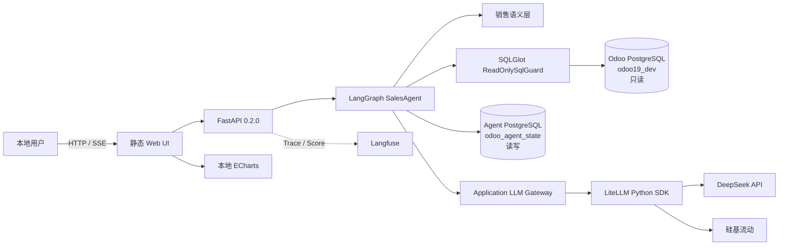
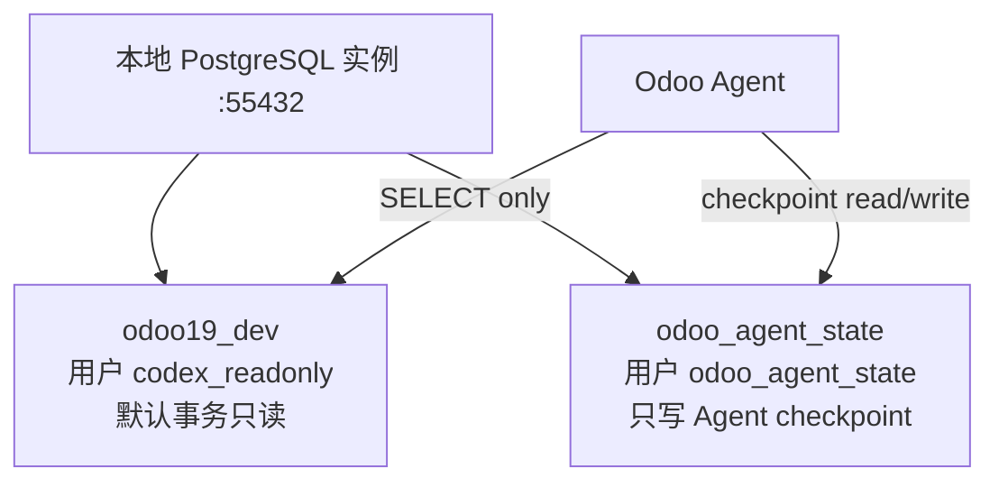
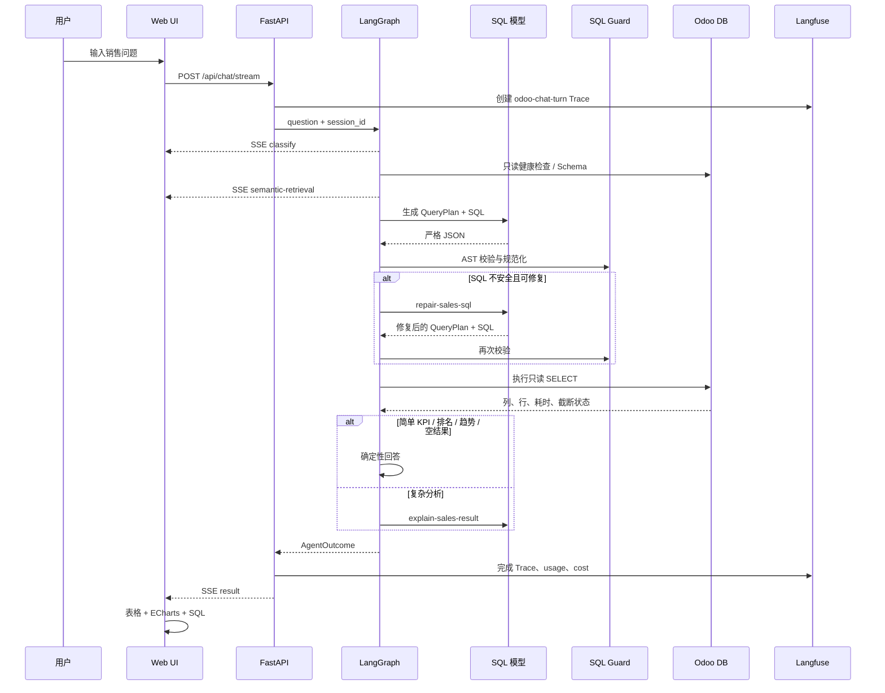
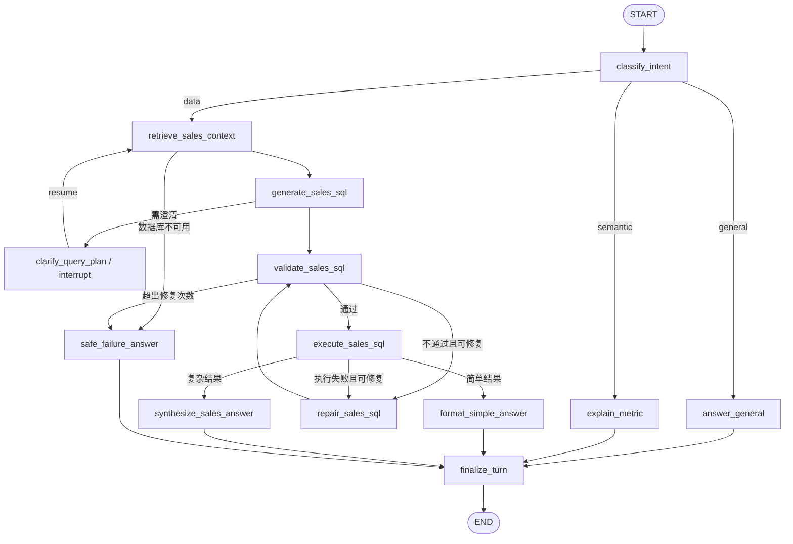
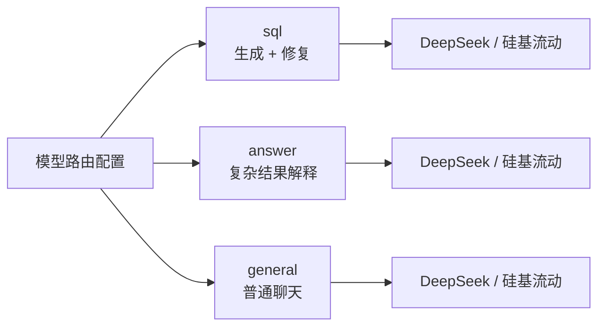

# 系统架构

> 适用应用版本：0.2.0
> 目标读者：架构师、后端开发、前端开发、运维

## 1. 架构概览

系统采用单体 FastAPI 后端、静态 HTML/CSS/JavaScript 前端、LangGraph 编排和双 PostgreSQL 数据库的本地架构。Odoo 数据库只读；Agent 状态库独立读写。模型调用通过统一网关接入 DeepSeek 或硅基流动；Trace、Cost、反馈和评测数据发送到 Langfuse。



## 2. 组件职责

| 组件 | 位置 | 主要职责 |
| --- | --- | --- |
| Web UI | 根目录 `*.html`、`app.js`、`styles.css` | 页面、配置、聊天、SSE 消费、结果与图表渲染 |
| FastAPI | `backend/app/main.py`、`api/` | API、静态文件托管、生命周期、错误边界 |
| SalesAgent | `backend/app/bi/agent.py` | 意图路由、Text2SQL、修复、执行、回答、Interrupt |
| QueryPlan | `backend/app/schemas/query_plan.py` | 固化模型内部结构化输出 |
| 销售语义层 | `backend/app/bi/sales_semantics.json` | 开放表字段、关系、指标、示例和版本 |
| SQL Guard | `backend/app/database/sql_guard.py` | AST 解析、安全策略、公司过滤、LIMIT |
| Odoo DB Client | `backend/app/database/client.py` | 强制只读连接、超时、查询执行、类型序列化 |
| State Store | `backend/app/state/checkpointer.py` | AsyncPostgresSaver 生命周期和内存降级 |
| LLM Gateway | `backend/app/llm/gateway.py` | LiteLLM 统一调用、节点模型路由、usage/cost；DeepSeek 原生适配、硅基流动 OpenAI 兼容适配 |
| Langfuse Adapter | `backend/app/observability/` | Trace、Observation、脱敏、Score、URL、flush |
| Evaluation | `evals/` | 黄金集、静态/真实回归、报告和 Dataset 同步 |

## 3. 部署拓扑

### 3.1 本地进程

| 进程 | 默认地址 | 说明 |
| --- | --- | --- |
| Odoo | `127.0.0.1:8019` | 本地 Odoo 19 |
| PostgreSQL | `127.0.0.1:55432` | 同一服务实例可承载两个独立数据库 |
| Odoo Agent | `127.0.0.1:8090` | FastAPI + 静态 UI |

### 3.2 数据库隔离



应用设置接口会拒绝把状态库配置成与 Odoo 相同的 host、port、database 组合。即便两个库位于同一个 PostgreSQL 实例，也必须是不同数据库和不同账号。

## 4. 一轮数据问题的数据流



## 5. LangGraph 工作流



详细节点协议见 [LangGraph Agent 工作流](07-langgraph-workflow.md)。

## 6. 状态和会话

- 浏览器为每个聊天窗口维护 `session_id`。
- Graph 的 `thread_id` 为 `odoo-sales-agent-v1:{session_id}`，避免和未来 Graph 版本冲突。
- 每个 Graph 步骤由 Checkpointer 保存状态。
- 正常启动时使用 `AsyncPostgresSaver`；未配置或连接失败时退回 `InMemorySaver`。
- API 通过 `GET /api/chat/sessions/{session_id}` 恢复消息和待处理 Interrupt。
- 同一会话的 Langfuse Trace 使用同一个 Session ID，但每轮问答仍是独立 Trace。

## 7. 模型路由



每个角色独立记录 provider、model、Token 和 Cost。简单结果不经过 `answer` 角色，因此可降低延迟和费用。

## 8. 图表架构

模型不生成 JavaScript 或任意 ECharts 配置。后端根据列和数据形状生成白名单 `ChartSpec`：

```json
{
  "type": "line",
  "title": "销售趋势",
  "x_field": "month",
  "y_fields": ["sales_amount"]
}
```

前端把 ChartSpec 和真实结果行转换为 ECharts option。该设计降低脚本注入、不可控配置和模型幻觉风险。

## 9. 可观测性边界

- 一轮用户问答：`odoo-chat-turn` Trace；
- Graph 子树：Agent Observation；
- 模型调用：Generation；
- 语义检索：Retriever；
- 数据库检查、SQL 校验和执行：Tool；
- 密钥、密码、Token、Cookie 和 Authorization 在发送前递归脱敏；
- Langfuse 不可用时，业务流程继续执行；
- 用户反馈由后端写入 `user-thumbs`，Secret Key 不进入浏览器。

## 10. 故障与降级

| 故障 | 行为 |
| --- | --- |
| 模型密钥未配置 | 请求前返回 503，不尝试业务查询 |
| 模型接口异常 | 返回受控错误，不暴露供应商原始敏感信息 |
| Odoo 不可用 | `data_accessed=false`，生成安全失败回答 |
| SQL 结构错误 | 最多两次修复；仍失败则停止执行 |
| SQL 执行错误 | 可进入修复；不返回虚假数字 |
| 状态库不可用 | 退回内存模式，当前进程仍可聊天 |
| Langfuse 不可用 | 不阻断回答，Trace/Score 暂不可用 |
| SSE 中异常 | 发送 `error` 事件，前端恢复输入状态 |

## 11. 关键架构决策

| 决策 | 原因 |
| --- | --- |
| FastAPI 单体 | 当前单用户、小数据量，降低部署和调试成本 |
| LangGraph 唯一编排层 | 避免同时引入多个 Agent 框架 |
| ECharts 替代 Metabase | 与对话结果紧密集成，前端直接控制展示 |
| 直接 PostgreSQL 只读查询 | 实时、结构明确、无需额外同步层 |
| Pydantic 原生结构化输出 | 当前结构化节点少，不急于增加 Instructor |
| 应用网关 + LiteLLM SDK | 保留业务角色路由和配置界面，以 LiteLLM 统一供应商调用；当前不增加独立 Proxy 服务 |
| 独立状态数据库 | Checkpoint 需要写权限，不能污染 Odoo 业务库 |
| 确定性快速回答 | 简单结果无需第二次模型总结 |

## 12. 相关文档

- [安装与配置](03-installation-and-configuration.md)
- [API 参考](05-api-reference.md)
- [数据语义与安全](06-data-and-security.md)
- [LangGraph Agent 工作流](07-langgraph-workflow.md)
