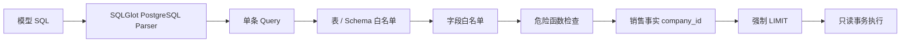

# 数据语义与安全

> 适用应用版本：0.2.0
>
> 语义层版本：2026-08-03.v1
> 核心原则：真实数据、最小暴露、双层只读、固定公司

## 1. 数据范围

当前 Agent 只开放销售分析所需的 9 张 Odoo 表和 71 个字段。模型无法看到完整 Odoo Schema，也不能请求未开放表。

| 表 | 用途 | 开放字段数 |
| --- | --- | ---: |
| `sale_order` | 销售订单事实 | 15 |
| `sale_order_line` | 产品、数量、交付、开票明细 | 19 |
| `res_partner` | 客户和联系人名称 | 6 |
| `product_product` | 产品规格 | 4 |
| `product_template` | 产品模板和名称 | 9 |
| `res_users` | 销售员关系 | 5 |
| `res_company` | 公司和币种 | 3 |
| `res_currency` | 币种展示 | 5 |
| `uom_uom` | 计量单位 | 5 |

## 2. 指标口径

### 2.1 默认规则

- 公司：所有销售事实查询必须限制为当前 `company_id`；
- 订单状态：默认只统计 `sale` 和 `done`；
- 时间字段：`sale_order.date_order`；
- 时区：`Asia/Shanghai`；
- 销售明细：排除 `display_type` 非空的展示行；
- 金额：默认未税；用户明确要求含税时使用 `amount_total`。

### 2.2 已开放指标

| 指标 ID | 中文名 | 表达式 | 说明 |
| --- | --- | --- | --- |
| `sales_amount` | 销售额 | `SUM(sale_order.amount_untaxed)` | 已确认订单未税金额 |
| `tax_included_sales` | 含税销售额 | `SUM(sale_order.amount_total)` | 已确认订单含税总额 |
| `order_count` | 订单数 | `COUNT(DISTINCT sale_order.id)` | 已确认销售订单数量 |
| `average_order_value` | 平均订单额 | 销售额 ÷ 订单数 | 分母为 0 时避免除零 |
| `sales_quantity` | 销售数量 | `SUM(sale_order_line.product_uom_qty)` | 非展示明细订购数量 |
| `delivered_quantity` | 已交付数量 | `SUM(sale_order_line.qty_delivered)` | 非展示明细交付数量 |
| `invoiced_quantity` | 已开票数量 | `SUM(sale_order_line.qty_invoiced)` | 非展示明细开票数量 |

语义层真源为 `backend/app/bi/sales_semantics.json`。修改指标必须提升其中 `version`，并增加黄金问题和测试。

## 3. 开放字段

### 3.1 `sale_order`

```text
id, name, state, company_id, partner_id, user_id, currency_id,
amount_untaxed, amount_tax, amount_total, date_order, commitment_date,
effective_date, delivery_status, invoice_status
```

### 3.2 `sale_order_line`

```text
id, order_id, company_id, order_partner_id, salesman_id, product_id,
product_uom_id, state, display_type, product_uom_qty, price_unit,
discount, price_subtotal, price_total, qty_delivered, qty_invoiced,
qty_to_invoice, is_downpayment, is_delivery
```

### 3.3 维度表

```text
res_partner:
  id, name, commercial_partner_id, customer_rank, active, is_company

product_product:
  id, product_tmpl_id, default_code, active

product_template:
  id, name, categ_id, uom_id, company_id, list_price, sale_ok, active, type

res_users:
  id, partner_id, company_id, active, share

res_company:
  id, name, currency_id

res_currency:
  id, name, symbol, position, rounding

uom_uom:
  id, name, relative_factor, factor, active
```

明确不开放：用户登录名、密码 Hash、Token、邮件、电话、地址、银行信息、会计凭证等非当前销售分析必需字段。

## 4. 关系

```text
sale_order.partner_id = res_partner.id
sale_order.user_id = res_users.id
res_users.partner_id = res_partner.id
sale_order.company_id = res_company.id
sale_order.currency_id = res_currency.id
sale_order_line.order_id = sale_order.id
sale_order_line.product_id = product_product.id
product_product.product_tmpl_id = product_template.id
sale_order_line.product_uom_id = uom_uom.id
```

产品模板和计量单位的名称可能为 JSONB 翻译字段。SQL 应优先取 `zh_CN`，再回退 `en_US`，不得直接假设为普通文本。

## 5. SQL 安全流水线



### 5.1 语法和语句类型

- 必须能按 PostgreSQL 方言解析；
- 只允许一条语句；
- 根表达式必须是 Query/SELECT；
- 禁止 INSERT、UPDATE、DELETE、MERGE、CREATE、ALTER、DROP、COPY、LOCK、事务和命令节点；
- CTE 可以使用，但 CTE 引用不会被误判为物理表。

### 5.2 表和 Schema

- 只允许 `public` 或不指定 Schema；
- 只允许语义层开放表；
- 查询必须至少使用一张开放 Odoo 表；
- 表别名会解析回真实表后再校验字段。

### 5.3 字段

- 禁止 `SELECT *`；
- 必须明确选择字段；
- 限定字段按表白名单校验；
- 非限定字段必须至少存在于当前真实表集合之一；
- 投影别名可在 ORDER BY 等位置使用。

### 5.4 危险函数

当前禁止：

```text
dblink
lo_export
lo_import
pg_ls_dir
pg_read_binary_file
pg_read_file
pg_sleep
pg_stat_file
set_config
```

### 5.5 公司过滤

只要查询包含 `sale_order` 或 `sale_order_line`，就必须在对应事实表上出现字面量：

```sql
company_id = <配置的公司 ID>
```

仅在无歧义的单事实表场景允许非限定 `company_id`。维度表上的公司过滤不能替代销售事实过滤。

### 5.6 LIMIT

- 没有 LIMIT：Guard 自动添加配置的 `ODOO_MAX_ROWS`；
- LIMIT 大于上限或无法静态确认：替换为配置上限；
- 数据库客户端额外只读取 `max_rows + 1` 行判断截断；
- `truncated=true` 时前端和回答必须提示结果被截断。

## 6. 数据库层防护

SQL Guard 不是唯一防线。每个 Odoo 连接同时设置：

```text
default_transaction_read_only=on
statement_timeout={configured_ms}
lock_timeout=3000
idle_in_transaction_session_timeout=15000
application_name=odoo-sales-agent-readonly
```

健康检查读取 `transaction_read_only`；只有实际为只读时才认为连接成功。正式账号还应在 PostgreSQL 权限层仅授予必要 SELECT。

## 7. 配置和 Secret 安全

- 不读取项目 `.env`；
- 设置保存在当前 Windows 用户 `HKCU\Environment`；
- 只允许服务端白名单变量名；
- GET `/api/settings` 只返回 `configured/password_configured`；
- Secret 输入为空时保留已有值；
- 启动脚本只刷新 Odoo Agent 管理前缀；
- 文档、日志、测试和 Git 禁止出现真实 Key 或密码。

建议定期检查：

```powershell
git status --short
rg -l --hidden --glob '!.git/**' 'sk-lf-|pk-lf-|DEEPSEEK_API_KEY=' .
```

该命令只用于发现疑似文件；不要在公共日志中输出命中的完整行。

## 8. Langfuse 数据边界

Trace 可能包含：

- 用户问题；
- 模型输入输出；
- QueryPlan 和 SQL；
- 查询结果的受限行；
- 模型、Token、Cost、耗时和错误类型。

发送前递归处理以下键名和字符串模式：

- authorization、cookie、credential、password；
- private/public key、secret、token、api_key；
- Langfuse Key、常见 `sk-` Key、Bearer Token。

当前业务数据安全被视为低优先级，但使用 Cloud Langfuse 仍意味着问题、SQL 和部分结果离开本机。未来接入真实敏感数据前，应增加字段级脱敏、采样和保留期策略。

## 9. Checkpoint 数据边界

状态库保存 Graph 状态和对话历史，可能包含：

- 问题和回答；
- QueryPlan；
- SQL；
- 受行数限制的结果行；
- Interrupt payload；
- Token、Cost 和警告。

状态库必须：

- 与 Odoo 业务数据库分离；
- 使用独立账号；
- 仅供本应用访问；
- 纳入本机数据清理和备份策略；
- 不把状态库密码写入仓库。

当前尚未提供会话删除 API。需要清理状态时，不应直接执行未知删除语句；应先补正式的会话管理接口和测试。

## 10. 威胁模型

| 风险 | 当前控制 | 剩余风险 |
| --- | --- | --- |
| Prompt Injection 要求写库 | QueryPlan + SQL AST + DB 只读 | 模型仍可能生成大量失败 SQL |
| 访问敏感表字段 | 表字段白名单 | 白名单内业务数据仍可能敏感 |
| 跨公司数据 | 事实表固定 company_id | 单公司设计，不支持用户级公司权限 |
| 大查询拖慢数据库 | timeout、LIMIT、lock timeout | 尚无 JOIN/CTE 复杂度预算和 EXPLAIN |
| Key 泄露 | Windows 用户环境、接口不回显、Trace 脱敏 | 本机用户仍可读取自己的环境变量 |
| 未授权访问 Web | 仅监听 127.0.0.1 | 无登录，不能直接对公网开放 |
| Cloud 观测泄露数据 | 脱敏 Secret | 业务问题和结果仍会上传 |
| 状态库丢失 | PostgreSQL Checkpoint | 尚无会话备份/删除/保留期 UI |

## 11. 当前安全边界

可以做：

- 本机单用户销售分析；
- 对低敏感测试数据使用 Langfuse Cloud；
- 使用只读账号查询固定公司；
- 查看生成 SQL 并提供反馈。

不应做：

- 暴露到公网或不可信局域网；
- 连接生产库高权限账号；
- 分析需要用户级权限隔离的数据；
- 让 Agent 执行写操作；
- 把真实密钥放入文档、代码、截图或提交记录。

## 12. 语义层变更流程

修改表、字段或指标时：

1. 说明业务口径和数据负责人；
2. 更新 `sales_semantics.json` 并提升 `version`；
3. 更新 `/sales/metrics` 预期；
4. 增加正常、空数据、跨公司和 Prompt Injection 黄金问题；
5. 增加 SQL Guard 单元测试；
6. 跑完整自动测试和静态黄金集；
7. 在只读测试库跑真实回归；
8. 用 Langfuse 对比准确率、延迟和 Cost；
9. 代码审查后发布。

## 13. 相关文档

- [系统架构](02-system-architecture.md)
- [评测与质量保障](09-evaluation-and-quality.md)
- [开发与运维](10-development-and-operations.md)
