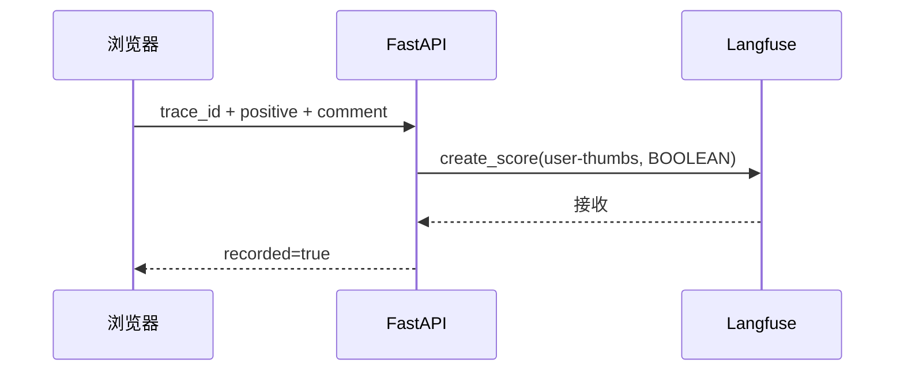

# Langfuse 可观测性

> 适用应用版本：0.2.0
>
> Python SDK：langfuse 4.14.3
>
> 当前项目：Langfuse Cloud EU
> 原则：一轮问答一个 Trace，一段聊天一个 Session

## 1. 目标

Langfuse 在本项目中用于回答以下问题：

- 用户问了什么，Agent 最终回答了什么？
- 路由走了哪些步骤？
- SQL 生成、校验、执行和解释分别耗时多久？
- 哪个节点使用了哪个供应商和模型？
- 输入、输出 Token 和估算 Cost 是多少？
- SQL 为什么被修复或失败？
- 用户对这条回答点赞还是点踩？
- 更换模型或 Prompt 后，黄金问题表现是否回归？

## 2. 配置

推荐在网站“数据与模型 → Langfuse 可观测性”配置，或运行：

```powershell
Set-Location D:\odoo19e\odoo-agent
.\configure-langfuse.ps1 -Region eu
```

所需变量：

```text
LANGFUSE_PUBLIC_KEY
LANGFUSE_SECRET_KEY
LANGFUSE_BASE_URL=https://cloud.langfuse.com
LANGFUSE_ENABLED=true
LANGFUSE_TRACING_ENABLED=true
```

Key 只保存在当前 Windows 用户环境变量。不要在 `.env`、文档、截图、命令历史或 Git 中保存真实值。

修改已初始化客户端的 Key 或 Base URL 后应重启后端。应用启动时执行认证预热，以便立即生成可点击 Trace URL。

## 3. Trace 范围

每次用户发送一条消息创建一个 Trace：

```text
trace name: odoo-chat-turn
root agent: answer-user-question
session id: 浏览器会话 ID
tags: odoo-agent, chatbi, sales
metadata: provider, access_mode=read-only
version: 0.2.0
```

多轮对话不会塞进一个无限增长的 Trace。每轮独立 Trace 便于定位延迟、Cost 和失败；相同 Session ID 用于在 Sessions 页面重放整段对话。

## 4. 当前 Trace 结构

### 4.1 数据问题

```text
Trace: odoo-chat-turn
└─ Agent: answer-user-question
   └─ Agent: route-and-answer-odoo-question
      ├─ Tool: check-odoo-readonly-database
      ├─ Retriever: retrieve-sales-semantic-context
      ├─ Generation: generate-sales-sql
      ├─ Tool: validate-readonly-sales-sql
      ├─ Generation: repair-sales-sql          # 仅需要修复时
      ├─ Tool: execute-readonly-sales-sql
      └─ Generation: explain-sales-result      # 仅复杂结果
```

简单 KPI、排名、趋势和空结果不会出现 `explain-sales-result`。这是验证快速路径是否生效的直接信号。

### 4.2 普通问答

```text
Trace: odoo-chat-turn
└─ Agent: answer-user-question
   └─ Agent: route-and-answer-odoo-question
      └─ Generation: answer-general-question
```

### 4.3 指标解释

指标解释主要读取本地语义层，不一定出现 Generation。根 Trace 的 `answer_mode=semantic`。

## 5. Observation 命名规则

当前名称使用动词开头、低基数、与模型无关的稳定名称。原因：

- Evaluator 通过 observation name 定位目标；
- Dashboard 和 Saved View 依赖名称；
- 模型切换不应改变观测名称；
- 动态值应放 input/output/metadata，不放名称。

禁止把日期、问题、Session ID、模型 ID 或修复次数拼进 Observation 名称。修复次数放 metadata。

## 6. Input、Output 和 Metadata

### 6.1 根 Trace

- Input：用户问题；
- Output：状态、回答、意图、provider/model、角色模型、回答模式、数据访问、行数、指标、警告和估算 Cost；
- Session：当前聊天会话；
- Tags：固定业务维度。

根 Input/Output 应让审核者无需展开全部节点就能判断这一轮发生了什么。

### 6.2 Generation

- Input：OpenAI 格式 messages；
- Output：模型原始文本；
- Model：供应商返回或配置的 Model ID；
- Metadata：provider、generation_role、feature、semantic_version、repair_number、pricing_currency、pricing_is_estimate；
- Usage：input/output/total；
- Cost：input/output/total USD。

### 6.3 Tool / Retriever

只记录理解步骤所需的信息，例如公司 ID、开放表、SQL、安全结果、行数、耗时和错误类型。不要记录数据库连接串或 Secret。

## 7. Token 与 Cost

### 7.1 为什么项目显式写 Cost

供应商 Model ID 可能不在 Langfuse 内置价格表中，尤其是硅基流动代理模型。本项目从供应商响应读取 Token，并按设置页单价计算后显式写入：

```json
{
  "usage_details": {"input": 1754, "output": 2128, "total": 3882},
  "cost_details": {"input": 0.00097, "output": 0.00355, "total": 0.00452}
}
```

### 7.2 计算

DeepSeek：

```text
input_cost_usd  = input_tokens  × input_price_usd_per_million  ÷ 1,000,000
output_cost_usd = output_tokens × output_price_usd_per_million ÷ 1,000,000
```

硅基流动：

```text
input_cost_usd  = input_tokens  × input_price_cny_per_million  ÷ 1,000,000 ÷ CNY_PER_USD
output_cost_usd = output_tokens × output_price_cny_per_million ÷ 1,000,000 ÷ CNY_PER_USD
```

这是内部估算，不是供应商最终账单。模型或价格变化后必须更新设置。

### 7.3 Cost 为 0 的排查顺序

1. 确认查看的是更新配置后的新 Trace；
2. 展开 Generation，确认 usage 非 0；
3. 检查供应商输入/输出单价是否大于 0；
4. 检查该 Generation 的 model 和 provider；
5. 确认代码使用 `cost_details` 更新 Observation；
6. 重启后再发新问题；
7. 最后才检查 Langfuse Model Definition。

## 8. Session

一个浏览器聊天窗口对应一个 Session ID。推荐使用 Sessions 页面分析：

- 追问是否正确引用历史；
- Interrupt 前后是否属于同一会话；
- 一段对话累计耗时和 Cost；
- 哪一轮开始出现错误；
- 后端恢复后 Trace 是否继续归入原 Session。

点击“新建会话”后应出现新的 Session ID。

## 9. 点赞 / 点踩 Score

### 9.1 当前协议

```text
name: user-thumbs
data_type: BOOLEAN
value: 1 = 👍, 0 = 👎
metadata.source: odoo-agent-chat
```

名称描述信号来源，而不是直接宣称“质量”。一次点踩不能自动说明是数字、口径、SQL、速度还是表达问题。

### 9.2 数据流



项目选择服务端写 Score：静态前端不需要持有 Langfuse Public Client，Secret Key 始终留在后端。

### 9.3 推荐运营方式

建立 Saved View：

```text
Trace name = odoo-chat-turn
Score user-thumbs = 0
```

每周复盘点踩 Trace，人工分类：

- intent 错误；
- 指标口径错误；
- 时间范围错误；
- SQL 错误；
- 结果解释错误；
- 图表不合适；
- 速度慢；
- 空结果处理问题。

重复出现的问题应加入黄金集。

## 10. Dataset

当前 Dataset：

```text
name: odoo-agent/sales-golden-v1
items: 20
local source of truth: evals/datasets/sales_golden.jsonl
```

当前 Langfuse Dataset ID：

```text
cmshiy2ey04fuad0d6ryauldf
```

本地 JSONL 是版本控制真源，Langfuse 用于：

- 浏览和人工审查案例；
- 创建模型/Prompt 实验；
- 比较多个 Run；
- 关联 Scores；
- 从真实失败 Trace 派生新案例。

同步：

```powershell
Set-Location D:\odoo19e\odoo-agent
.\.venv\Scripts\python.exe .\evals\run_sales_eval.py --sync-langfuse
```

同步内容为问题和预期结构，不上传真实 Odoo 查询结果。

## 11. 日常排错流程

### 11.1 回答错误

1. 看根 Input/Output 和 `answer_mode`；
2. 看 intent 是否正确；
3. 看 Retriever 是否选择正确指标和表；
4. 看 `generate-sales-sql` 的 QueryPlan 和 SQL；
5. 看 SQL Guard 错误和 repair；
6. 看 Tool 执行的行数、列和耗时；
7. 看 `explain-sales-result` 是否忠实；
8. 将根因记录为 Score/Comment，并加入黄金集。

### 11.2 回答慢

按耗时排序 Observation：

- SQL Generation 慢：换更快 SQL 模型、压缩语义上下文或限制输出；
- Answer Generation 慢：确认是否本应走确定性快速路径；
- DB Tool 慢：检查 SQL、返回规模、timeout 和数据库；
- Trace 总耗时大于子节点之和：检查启动、网络、排队和 SDK flush。

### 11.3 SQL 经常修复

按 `repair-sales-sql` 筛选并统计错误类型。优先改语义定义、验证示例或 Prompt，不要只增加重试次数。

## 12. 推荐 Saved Views 和 Dashboard

| 名称 | 过滤 / 分组 | 用途 |
| --- | --- | --- |
| 销售全部 Trace | name=`odoo-chat-turn` | 总览 |
| 用户点踩 | score `user-thumbs=0` | 质量复盘 |
| SQL 修复 | observation=`repair-sales-sql` | Text2SQL 稳定性 |
| SQL Generation 延迟 | observation=`generate-sales-sql` | p50/p95 |
| 模型成本 | type=Generation，group by model | 成本对比 |
| 简单查询二次调用 | 简单问题中存在 explain | 快速路径回归 |
| 会话追问 | Sessions | 多轮理解 |

## 13. CLI 只读查询

CLI 使用当前用户环境中的 Key。不要在命令中硬编码 Key。

```powershell
$env:LANGFUSE_HOST = [Environment]::GetEnvironmentVariable('LANGFUSE_BASE_URL', 'User')
npx --yes langfuse-cli api traces get TRACE_ID --fields core,observations,metrics --json
```

发现接口：

```powershell
npx --yes langfuse-cli api __schema
npx --yes langfuse-cli api traces get --help
```

输出 Trace 时注意其中可能包含业务问题、SQL 和结果，不要直接贴到公共 Issue。

## 14. Trace 质量检查表

每次调整观测代码后，必须真实运行并回查 Trace：

- [ ] 一轮问答只有一个根 Trace；
- [ ] 多轮使用相同 Session ID；
- [ ] 根 Input 是用户问题，Output 是可判断结果；
- [ ] Graph 正确嵌套在根 Agent 下；
- [ ] LLM 是 Generation，数据库/校验是 Tool，语义检索是 Retriever；
- [ ] 名称稳定、无动态值、与模型名称无关；
- [ ] Generation 有 model、usage 和 cost；
- [ ] SQL 修复次数位于 metadata；
- [ ] Trace 无 API Key、密码、Token、Cookie；
- [ ] 简单结果没有多余 explain Generation；
- [ ] Trace URL 能从回答直接打开；
- [ ] 👍/👎 出现在对应 Trace Scores 中。

## 15. 当前已知限制

- 应用的 `ODOO_AGENT_ENVIRONMENT` 尚未显式映射到 Langfuse environment；测试和日常 Trace 可能使用 SDK 默认环境。下一步应增加稳定环境标签，防止测试污染正式 Dashboard。
- Prompt 仍在代码中，尚未使用 Langfuse Prompt Management 和 Prompt 版本关联。
- 当前只有人工 `user-thumbs` Score，尚未配置 LLM-as-a-Judge。
- 页面尚未收集点踩原因和文字备注。
- 真实回归运行器已能产生 Trace，但尚未自动创建完整 Langfuse Experiment Run 和 CI 门禁。

## 16. 官方参考

- [Langfuse Observability Best Practices](https://langfuse.com/docs/observability/best-practices)
- [User Feedback](https://langfuse.com/docs/observability/features/user-feedback)
- [Token & Cost Tracking](https://langfuse.com/docs/observability/features/token-and-cost-tracking)
- [Sessions](https://langfuse.com/docs/observability/features/sessions)
- [Datasets](https://langfuse.com/docs/evaluation/experiments/datasets)
- [Scores Overview](https://langfuse.com/docs/evaluation/scores/overview)

## 17. 相关文档

- [评测与质量保障](09-evaluation-and-quality.md)
- [开发与运维](10-development-and-operations.md)
