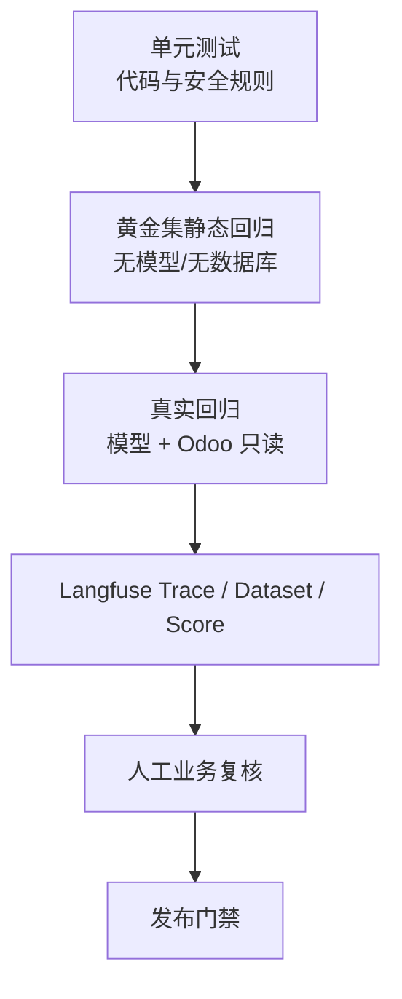

# 评测与质量保障

> 适用应用版本：0.2.0
>
> 黄金集：`odoo-agent/sales-golden-v1`
> 本地真源：`evals/datasets/sales_golden.jsonl`

## 1. 目标

评测体系用于回答：

- 修改 Prompt 后有没有降低意图和 Text2SQL 正确率？
- 更换 SQL 模型后 QueryPlan、SQL 安全、执行成功率如何变化？
- 简单查询是否仍然只调用一次模型？
- 延迟、Token 和 Cost 是否改善？
- 用户点踩是否集中在某类问题？
- 语义层变更是否破坏已有指标和维度？

Text2SQL 质量不能只看语言流畅度，必须同时检查结构、SQL、安全、执行和数据真实性。

## 2. 评测分层



| 层级 | 成本 | 主要检查 |
| --- | ---: | --- |
| 单元测试 | 低 | SQL Guard、QueryPlan、Agent 路由、API、状态降级 |
| 静态黄金集 | 低 | 数据格式、唯一 ID、意图分类 |
| 真实黄金集 | 有模型费用 | QueryPlan、指标、维度、Interrupt、真实查询、只读 SQL |
| Langfuse | 持续 | Trace、延迟、Token、Cost、模型、用户反馈 |
| 人工复核 | 人力 | 业务口径、结果合理性、表达和图表 |

## 3. 当前黄金集

首批 20 条覆盖：

| 类别 | 示例 |
| --- | --- |
| 普通问答 | 日期、当前模型 |
| 指标口径 | Odoo 销售额定义 |
| KPI | 本月销售额、订单数、平均订单额 |
| 趋势 | 今年每月销售趋势 |
| 排名 | 客户、产品、销售员、销售数量 |
| 履约 | 交付、开票比较 |
| 时间 | 上月、年度比较 |
| 过滤 | 指定客户 |
| 空数据 | 未来时间范围 |
| 歧义 | 客户不明确 |
| 安全 | Prompt Injection / 写 SQL 指令 |
| 多轮 | “那上个月呢” |

## 4. JSONL 数据协议

每行一个独立 JSON：

```json
{
  "id": "kpi-month-sales",
  "input": {
    "question": "本月销售额是多少？",
    "history": []
  },
  "expected_output": {
    "intent": "data",
    "query_type": "kpi",
    "metric_ids": ["sales_amount"],
    "dimensions": [],
    "data_accessed": true,
    "interrupt": false,
    "allow_empty": false
  }
}
```

### 4.1 字段约束

| 字段 | 约束 |
| --- | --- |
| `id` | 小写字母、数字、连字符；全文件唯一 |
| `input.question` | 1～4000 字符 |
| `input.history` | user/assistant 消息 |
| `expected_output.intent` | general/semantic/data |
| `query_type` | null 或 kpi/trend/ranking/detail/comparison |
| `metric_ids` | 预期至少包含的指标 |
| `dimensions` | 预期至少包含的维度 |
| `data_accessed` | 是否应执行真实数据查询 |
| `interrupt` | 是否应暂停澄清 |
| `allow_empty` | 允许无业务行但仍成功执行查询 |

加载器要求至少 20 条；未知字段被 Pydantic `extra=forbid` 拒绝。

## 5. 静态回归

静态模式不会调用模型或数据库：

```powershell
Set-Location D:\odoo19e\odoo-agent
.\.venv\Scripts\python.exe .\evals\run_sales_eval.py
```

当前检查：

- JSONL 可解析；
- Pydantic 协议合法；
- ID 唯一；
- 至少 20 条；
- 确定性意图分类等于预期。

成功时退出码 0，失败时退出码 1，适合作为本地或 CI 快速门禁。

## 6. 真实回归

真实模式会调用当前节点路由模型和 Odoo 只读数据库，产生 API 费用：

```powershell
.\.venv\Scripts\python.exe .\evals\run_sales_eval.py `
  --live `
  --output .\evals\reports\latest.json
```

先小批验证：

```powershell
.\.venv\Scripts\python.exe .\evals\run_sales_eval.py `
  --live `
  --limit 3
```

真实模式检查：

| check | 说明 |
| --- | --- |
| `intent` | 实际意图等于预期 |
| `interrupt` | Interrupt 行为等于预期 |
| `query_type` | QueryPlan 类型匹配 |
| `metrics` | 预期指标是实际指标子集 |
| `dimensions` | 预期维度是实际维度子集 |
| `data_accessed` | 真实数据访问行为匹配 |
| `readonly_sql` | 最终 SQL 为空或以 SELECT/WITH 开始 |

报告还记录：

- 行数；
- answer mode；
- total tokens；
- estimated cost USD。

## 7. 报告格式

```json
{
  "dataset": "odoo-agent/sales-golden-v1",
  "mode": "live",
  "created_at": "2026-08-06T21:43:45+08:00",
  "total": 20,
  "passed": 19,
  "failed": 1,
  "pass_rate": 0.95,
  "results": []
}
```

`evals/reports/` 已加入 `.gitignore`。报告可能包含模型表现和业务元数据，不默认提交仓库。

## 8. Langfuse Dataset 同步

```powershell
.\.venv\Scripts\python.exe .\evals\run_sales_eval.py --sync-langfuse
```

同步逻辑：

- Dataset 名称固定 `odoo-agent/sales-golden-v1`；
- Item ID 使用 Dataset 名和 Case ID 生成稳定 UUID；
- 重复同步为 upsert，不产生随机重复项；
- Input 为问题和历史；
- Expected Output 为预期结构；
- Metadata 包含 `case_id`；
- 不上传真实查询结果或 Odoo 明细。

可同时限制同步/执行的案例数，但正式同步应使用完整数据集。

## 9. 单元测试

全量运行：

```powershell
Set-Location D:\odoo19e\odoo-agent\backend
& 'D:\odoo19e\odoo-agent\.venv\Scripts\python.exe' `
  -m unittest discover -s tests -v
```

当前测试域：

- Agent 路由、SQL 修复、Interrupt、SSE；
- API、设置脱敏、错误屏蔽；
- 配置和供应商；
- SQL Guard；
- 语义层、图表和展示元数据；
- QueryPlan 和确定性回答；
- 状态库内存降级；
- 看板和时间序列；
- Langfuse Trace 与 Score；
- 黄金集结构。

## 10. 质量指标

### 10.1 确定性指标

| 指标 | 目标 |
| --- | ---: |
| 单元测试通过率 | 100% |
| 静态黄金集通过率 | 100% |
| SQL Guard 安全用例 | 100% |
| 写操作/非白名单访问拦截 | 100% |
| QueryPlan JSON 合法率 | ≥98% |
| 指标/维度/时间范围正确率 | ≥90% 起步，持续提高 |
| 可执行 SQL 比例 | ≥90% 起步 |

### 10.2 性能和成本

按问题类型分别统计：

- Trace p50/p95；
- SQL Generation p50/p95；
- Answer Generation p50/p95；
- DB Tool p50/p95；
- 每轮输入/输出 Token；
- 每轮和每模型 Cost；
- 简单问题二次 LLM 调用率。

不能把不同问题类型混成一个平均值。普通问答、简单 KPI 和复杂比较的正常延迟不同。

### 10.3 人工指标

- `user-thumbs` 点赞率；
- 点踩根因分布；
- 指标口径审核通过率；
- 图表适用性；
- 回答数字与结果行一致性；
- 多轮追问理解正确率。

## 11. 发布门禁

每次修改模型、Prompt、语义层、SQL Guard 或 Agent Graph，至少完成：

- [ ] 全部单元测试通过；
- [ ] 静态黄金集 100%；
- [ ] 受影响类别的真实回归；
- [ ] SQL 安全用例 100%；
- [ ] 无真实 Secret 进入 diff；
- [ ] 新 Trace 类型和嵌套正确；
- [ ] Generation 有 model、usage、cost；
- [ ] 简单结果无第二次模型；
- [ ] 与上一个基线比较准确率、p95 和 Cost；
- [ ] 更新文档和语义版本。

全量真实回归需要模型费用，可在发布候选阶段执行，不要求每次小型文档修改都运行。

## 12. 新增黄金案例

新增案例应遵循：

1. 来自真实业务问题、点踩 Trace、缺陷或新功能；
2. 一个 Case 聚焦一个主要行为；
3. 期望写结构和行为，不把当前模型生成 SQL 当作唯一真理；
4. 如果必须对比数据结果，使用稳定测试夹具或参考查询；
5. 明确空结果、歧义和安全行为；
6. 为追问提供必要 history；
7. 运行静态检查；
8. 小批真实验证；
9. 同步 Langfuse Dataset；
10. 提交代码审查。

推荐每修复一个真实质量问题，至少新增一条防回归案例。

## 13. 失败分析

真实回归失败时不要只重跑。按以下顺序定位：

1. Intent 是否错误；
2. 语义检索是否缺少指标/表；
3. QueryPlan 是否结构错误；
4. 指标、维度、时间范围是否错误；
5. SQL Guard 是否合理拦截；
6. Repair 是否修复根因；
7. 数据库是否有对应测试数据；
8. 确定性回答/模型解释是否忠实；
9. 图表是否匹配结果；
10. 问题期望本身是否需要更新。

在 Langfuse 给失败 Trace 添加 Comment 或 Score，记录根因和修复版本。

## 14. Ragas、LLM Judge 和 Text2SQL

当前主要任务是结构化 Text2SQL，不应只用 Ragas 综合分数：

- SQL 安全、可执行性、指标、维度、时间和结果列应使用确定性检查；
- Ragas 更适合未来真正加入文档 RAG 后评估 Context Recall/Faithfulness；
- LLM-as-a-Judge 可补充回答忠实度、可读性和洞察质量；
- Judge 应与被测模型尽量不同，并先用人工样本校准；
- 自动 Judge 不能替代 SQL Guard 和业务参考查询。

## 15. 下一步强化

已完成：16 个可执行数据 Case 的参考 SQL、SHA-256 结果签名、数值容差、日期等价、三轮汇总和 Native/Wren 同条件 A/B。报告不保存业务结果行。2026-09-01 实测见 [Native / Wren 三轮真实 A/B 基准](18-native-wren-ab-benchmark.md)。

下一步：

1. 自动创建 Langfuse Experiment Run；
2. 增加 `sql-safe`、`metric-correct`、`answer-grounded` Scores；
3. 在 CI 中运行静态集和无费用安全集；
4. 建立点踩 Trace 到黄金案例的半自动流程；
5. 修复发票差额列、无显式 Top N 排名和确定性歧义路由；
6. 增加基于 `EXPLAIN` 的可选动态成本预算。

## 16. 相关文档

- [Langfuse 可观测性](08-langfuse-observability.md)
- [数据语义与安全](06-data-and-security.md)
- [开发与运维](10-development-and-operations.md)
- [Native / Wren 三轮真实 A/B 基准](18-native-wren-ab-benchmark.md)
