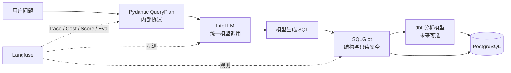

# 核心技术组件状态

> 状态日期：2026-08-07
>
> 适用应用版本：0.2.0
>
> 核对范围：运行依赖、实际代码调用、测试和当前架构，不以规划文件中的名称代替真实落地

## 1. 总览

| 组件 | 当前状态 | 主要用途 | 当前落点 |
| --- | --- | --- | --- |
| SQLGlot | 已落地 | SQL AST 解析、只读安全、字段/表/限制检查 | `backend/app/database/sql_guard.py` |
| Pydantic | 已落地 | QueryPlan、API Schema、配置和评测协议 | `backend/app/schemas/`、`backend/app/config.py` |
| Instructor | 未接入 | 让 LLM 返回经过 Pydantic 校验的结构化对象，并自动重试修复 | 当前由 JSON Mode + Pydantic + 自定义 repair 代替 |
| Langfuse | 已落地首版 | Trace、Session、Token、Cost、Score、Dataset | `backend/app/observability/`、`evals/` |
| dbt Core | 未接入 | 建模、转换、数据测试、文档、血缘、分析宽表 | 当前直接查询 Odoo PostgreSQL |
| LiteLLM | 已落地 SDK 首版 | 统一模型供应商调用和异常接口，后续支持 Router/fallback | `backend/app/llm/gateway.py` |

结论：五项里，SQLGlot、Pydantic、Langfuse、LiteLLM 已实际进入运行链路；“Pydantic + Instructor”只完成了 Pydantic 部分；dbt Core 尚未引入。

## 2. SQLGlot

### 2.1 它解决什么问题

SQLGlot 把 SQL 解析成抽象语法树，而不是使用字符串或正则猜测 SQL 是否安全。它适合：

- 判断是否只有一条语句；
- 判断根节点是否是查询；
- 找出访问的表、字段、函数、Join、Limit；
- 识别 DDL/DML、系统目录或危险构造；
- 对不同 SQL 方言进行规范化或转换；
- 为复杂度限制和静态评测提供结构信息。

### 2.2 当前怎么用

当前 `ReadOnlySqlGuard` 在 SQL 执行前完成：

1. SQLGlot PostgreSQL 方言解析；
2. 单语句检查；
3. 只读查询检查；
4. 表和字段白名单；
5. 公司过滤和最大行数约束；
6. 失败后把安全错误交给 SQL repair 节点，最多修复两次。

数据库连接本身还设置了 PostgreSQL `default_transaction_read_only=on`，所以 SQLGlot 是应用层防线，数据库只读账号是最终防线。

### 2.3 下一步

- 最大 Join 数；
- 最大 CTE 和子查询深度；
- 笛卡尔积识别；
- 明细查询必须带时间范围；
- 可选 `EXPLAIN (FORMAT JSON)` 成本门槛；
- 高成本查询进入 LangGraph Interrupt。

## 3. Pydantic 与 Instructor

### 3.1 Pydantic 已经做了什么

Pydantic 是项目的数据契约层，当前用于：

- `QueryPlan`：约束 intent、query type、指标、维度、过滤、SQL、图表和歧义状态；
- API 请求和响应 Schema；
- 模型与数据库配置；
- ECharts 白名单 `ChartSpec`；
- 黄金问题和评测结果协议。

模型返回 JSON 后，项目自行提取 JSON，再执行 `QueryPlan.model_validate()`。校验失败会进入明确的 repair 流程。

### 3.2 Instructor 是什么

Instructor 构建在 Pydantic 之上，把 `response_model` 交给模型调用层，自动完成结构化输出、Pydantic 校验和失败重试。它主要减少以下胶水代码：

- JSON 提取；
- Schema 拼接；
- 校验失败重试；
- 将模型响应转换成 Pydantic 实例；
- 记录每次结构化重试。

### 3.3 为什么现在没有接

当前只有一个主要结构化协议 QueryPlan，而且现有 JSON Mode、Pydantic 校验和 SQL repair 已经可测试、可观测。立即增加 Instructor 会与现有 repair 职责重叠，也要确认其与 LiteLLM、DeepSeek/硅基流动 JSON Mode、Langfuse Generation 的组合行为。

### 3.4 什么时候值得接

满足任一条件时做独立分支实验：

- 结构化 LLM 节点达到三个以上；
- QueryPlan 首轮合法率低于 98%；
- JSON 提取错误成为主要失败来源；
- 希望把 repair 重试统一到结构化调用层；
- LiteLLM + Instructor 的组合能在黄金集上减少代码且不增加延迟。

Instructor 不负责 SQL 安全，即使接入也不能替代 SQLGlot。

## 4. Langfuse

### 4.1 它解决什么问题

Langfuse 是 LLM 应用的可观测和评测平台，用于回答：

- 一轮问题经过了哪些 Agent、Retriever、Generation 和 Tool；
- 哪一步最慢；
- 每个模型消耗多少 Token 和 Cost；
- 用户对哪条 Trace 点赞或点踩；
- 哪个 Prompt/模型版本在黄金集上更好；
- 一段多轮会话包含哪些 Trace。

### 4.2 当前怎么用

当前已经实现：

- 一轮问答一个 Trace；
- Session 关联多轮会话；
- LangGraph 节点层级 Observation；
- SQL、普通回答、解释分别记录 Generation；
- usage 和估算 Cost；
- 点赞/点踩 `user-thumbs` Score；
- 20 条黄金问题同步为 Dataset；
- 敏感字段和 Key 脱敏；
- Trace URL 返回前端。

LiteLLM 接入后仍由应用的 Langfuse Adapter 统一记录，不启用 LiteLLM Langfuse callback，避免一次模型调用出现两套重复 Generation。

### 4.3 下一步

- 显式设置 development/test/production；
- Prompt Management 和 Prompt 版本；
- 点踩原因分类；
- Dataset Experiment；
- LLM Judge；
- 发布质量门禁。

## 5. dbt Core

### 5.1 它解决什么问题

dbt Core 适合把原始业务库转换成稳定的分析模型。典型能力包括：

- 用 SQL 模型生成事实表、维度表和分析宽表；
- 用 tests 检查唯一性、非空、关系和业务规则；
- 生成模型文档和数据血缘；
- 复用指标和 Join，避免每个消费者重新理解 Odoo 表；
- 将复杂 Odoo 关系隔离在数据模型中，使 Text2SQL 面向更简单的分析表。

### 5.2 当前为什么没有接

项目现在只有一个公司、一个用户、少量销售数据，并要求接近实时。直接只读查询九张 Odoo 表可以满足需求，引入 dbt 会同时增加：

- 独立分析 Schema；
- 模型构建和刷新任务；
- 增量策略；
- Odoo 升级后的模型维护；
- 实时性与稳定性之间的选择。

### 5.3 什么时候值得接

- 开始分析发票、回款、库存、毛利等多个主题；
- 同一组复杂 Join 在多处重复；
- 除本 Agent 外还有报表或其他应用消费指标；
- 需要数据质量测试和血缘；
- Odoo 原始 Schema 已经明显降低 Text2SQL 正确率。

届时建议让 dbt 写入独立 analytics Schema，Agent 只读该 Schema，不在 Odoo 业务表上创建对象。

## 6. LiteLLM

### 6.1 它解决什么问题

LiteLLM 为不同模型供应商提供统一的 OpenAI 风格接口，并标准化响应和异常。进一步可提供：

- 多供应商模型适配；
- Router、重试、fallback 和负载均衡；
- 统一 usage/cost；
- Proxy、Virtual Key、预算和限流；
- 缓存、Guardrail 和观测 callback。

### 6.2 当前怎么接

当前采用 LiteLLM Python SDK 直连，而不是独立 Proxy：

```text
LangGraph node
  -> Application LLMGateway
  -> LiteLLM acompletion
  -> DeepSeek native adapter / SiliconFlow OpenAI-compatible adapter
```

保留现有应用配置的原因：

- 设置页仍可直接切换 DeepSeek/硅基流动和 Model ID；
- `sql`、`answer`、`general` 的业务角色路由不依赖供应商；
- Langfuse 命名、脱敏和 Cost 口径保持稳定；
- 用户不需要额外启动 4000 端口的 Proxy 服务。

### 6.3 当前没有启用什么

- LiteLLM Proxy；
- Virtual Key；
- 集中预算与限流；
- 自动 Router fallback；
- LiteLLM 自带 Langfuse callback；
- 缓存。

这些不是“没有接入”，而是当前单用户本地场景不需要的第二阶段能力。

### 6.4 下一步

1. 使用黄金集记录接入前后准确率、延迟和 Cost；
2. 为模型异常建立统一错误分类；
3. 增加第三个供应商时验证 Router；
4. 用 Dataset Experiment 验证 fallback 不改变指标口径；
5. 多应用共享或需要集中预算时再部署 LiteLLM Proxy。

## 7. 五个组件之间的关系



它们不是互相替代关系：

- LiteLLM 管“调用哪个模型、怎样统一调用”；
- Pydantic/Instructor 管“模型必须返回什么结构”；
- SQLGlot 管“生成的 SQL 是否结构正确和安全”；
- dbt 管“数据库向 Agent 暴露什么分析模型”；
- Langfuse 管“整个过程是否可观察、可评价、可比较”。

## 8. 当前推荐顺序

1. LiteLLM SDK：已完成首版；
2. SQLGlot 复杂度保护：下一项高优先级；
3. Langfuse Prompt/Dataset Experiment：用于证明改动有效；
4. Instructor：先做小实验，再决定是否替换自定义结构化 repair；
5. dbt Core：等销售之外的主题和重复 Join 真正出现后引入。

## 9. 相关文档

- [系统架构](02-system-architecture.md)
- [LangGraph Agent 工作流](07-langgraph-workflow.md)
- [Langfuse 可观测性](08-langfuse-observability.md)
- [评测与质量保障](09-evaluation-and-quality.md)
- [演进路线](11-roadmap.md)
