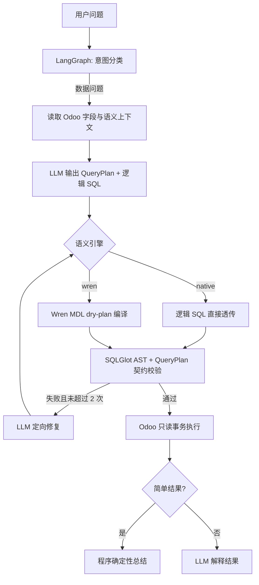

# Wren AI 语义编译集成

## 1. 目标与结论

本项目采用“小步融合、可随时切回”的方式接入 Wren AI。LangGraph 继续负责状态、分支、重试、Checkpoint、Interrupt 和 SSE；Wren 只负责 MDL 语义上下文与 `dry-plan` SQL 编译；SQLGlot 和 Odoo 只读连接仍是最终安全与执行边界。

这不是用 Wren 替换现有 Agent，也不是把 Wren 工具交给一个无约束 ReAct 循环。原生语义层保留为稳定基线，设置页可在 `native` 和 `wren` 之间切换，便于 A/B 回归。

## 2. 实际数据流



新增的 `compile_semantic_sql` 是一个确定性 LangGraph 节点：Wren 失败会进入现有修复循环，而不是让模型自行反复选择工具。

## 3. 为什么没有直接使用 LangGraph ToolNode

Wren 的 LangChain 兼容工具适合通用工具调用 Agent；当前项目的执行次序、安全审计和低延迟要求更适合固定节点。直接把 `wren_query` 暴露给模型会让 Wren 绕开本项目的 SQLGlot Guard 和 `OdooDatabase.execute_readonly`，因此本阶段明确不使用：

- `wren_query`：不让 Wren 直接连接或查询 Odoo；
- 自动 `wren_store_query`：未经人工确认的结果不进入长期记忆；
- 通用 ReAct 循环：避免模型重复选工具、增加延迟和不可预测性。

本项目只使用 Wren CLI/SDK 核心的 `context build`、`memory describe`、`context instructions` 和 `dry-plan`。它们被封装在应用节点中，不改变数据库权限。

## 4. 目录与职责

| 路径 | 职责 |
|---|---|
| `backend/app/bi/semantic_provider.py` | `SemanticContextProvider` 接口、原生/Wren 实现、Wren 进程隔离与缓存 |
| `backend/app/bi/wren_project/` | 9 个 Odoo 销售 MDL 模型、关系和业务规则 |
| `backend/app/bi/agent.py` | `compile_semantic_sql` 节点与修复回路 |
| `backend/app/database/sql_guard.py` | 物理 SQL 白名单、QueryPlan 输出列/过滤来源/LIMIT 校验 |
| `backend/app/schemas/query_plan.py` | 结构化结果形状、输出列、排序、行数与过滤来源合同 |

`target/mdl.json` 是 Wren 构建产物，已加入 `.gitignore`，首次使用 Wren 时自动生成。

## 5. QueryPlan 合同

QueryPlan 在原有指标、维度、时间和澄清字段之外增加：

- `result_shape`：`scalar`、`time_series`、`ranking` 或 `table`；
- `select_columns`：最终 SELECT 输出别名及顺序；
- `sort`：排序字段和方向；
- `row_limit`：用户明确要求 Top N 时的结果行数；未指定 N 的完整排名为 `null`；
- `filters[].source`：`user`、`metric_rule` 或 `system_required`。

SQLGlot 会校验最终物理 SQL：输出列必须与合同一致；显式 Top N 的 LIMIT 必须一致；未指定 N 的完整排名由 Guard 自动追加全局安全上限，ChartPlan 只展示前 10。WHERE 中的过滤字段必须在 QueryPlan 或时间范围内声明。公司隔离只能标记为系统要求，订单状态和展示行排除只能标记为指标规则，用户条件必须能从问题语义中得到授权。

这类合同能拦截“模型擅自增加 active、is_downpayment、客户范围”等隐蔽过滤，但不能证明 SQL 的全部业务语义正确，因此仍需要黄金问题回归和人工 Score。

## 6. 使用方法

1. 启动应用，进入“数据与模型”。
2. 在“销售指标口径”中选择：
   - `原生语义层（稳定基线）`：现有流程；
   - `Wren MDL（实验对比）`：启用 MDL 上下文和 dry-plan。
3. 保存设置。新的聊天立即使用所选语义引擎。
4. 在 Langfuse Trace 中查看新增节点：
   - 原生：`prepare-native-sql`；
   - Wren：`compile-wren-semantic-sql`。
5. 使用同一批黄金问题分别运行两种模式，比较 Semantic Accuracy、Strict Accuracy、p50/p95、修复次数和 Token/Cost。

设置页的“SQL 深度思考”默认关闭，只作用于 SQL 生成/修复节点。它与 Wren 的职责不同：关闭思考主要降低模型延迟；Wren 主要提高 schema、关系和规则的一致性。A/B 时应固定同一个模型和思考模式。

也可临时用环境变量切换：

```powershell
[Environment]::SetEnvironmentVariable('SEMANTIC_PROVIDER', 'wren', 'User')
```

默认内置项目路径为 `backend/app/bi/wren_project`。只有自定义 MDL 项目时才需要配置 `WREN_PROJECT_PATH`；只有 Wren 不在应用虚拟环境时才需要配置 `WREN_EXECUTABLE`。

## 7. 验证命令

```powershell
Set-Location D:\odoo19e\odoo-agent

& .\.venv\Scripts\python.exe -m unittest discover -s backend\tests -p 'test_*.py'
node --check .\app.js

$env:PYTHONUTF8='1'
$env:PYTHONIOENCODING='utf-8'
& .\.venv\Scripts\wren.exe context build --path .\backend\app\bi\wren_project
```

## 8. 能解决什么，不能解决什么

预计可以直接改善：

- 多表关系选择和 JOIN 路径的一致性；
- 原始 schema 提示过长、同义词和业务规则分散；
- 将语义 SQL 与物理 SQL 分离，便于修改表结构；
- 用独立 Langfuse 节点观察 Wren 编译耗时与失败类型。

不能单独解决：

- 模型推理本身过慢；
- 相对时间、空数据与追问上下文的所有问题；
- 结果解释是否完全忠于数据；
- 语义模型自身定义错误。

因此 Wren 是准确率改良组件，不是“一键解决 Text2SQL”的替代系统。最终是否默认启用，必须由同模型、同温度、同黄金集的 A/B 数据决定。

## 9. 2026-09-01 三轮 A/B 结论

同一 DeepSeek `deepseek-v4-pro`、同一 20 Case、同一只读数据库和结果签名合同下，修后 Native 总通过率为 93.33%，Wren 为 86.67%；结果签名率分别为 93.75% 和 87.50%。Wren p50/p95 分别慢 1.21s/5.47s，并多使用 70,611 Token。

Wren Guard 兼容缺陷修复使 2026-09-01 全量基准总通过率从 61.67% 提高到 86.67%。2026-09-02 又对 `ranking-salespeople`、`comparison-invoice` 和 `clarify-customer` 做了 TDD 修复；Native/Wren 针对性三轮都达到 9/9，结果签名均为 100%。由于尚未在这些增量修改后重跑 20 Case × 3 轮全量 A/B，当前仍保留 `native` 为默认、`wren` 为实验选项。完整方法和数据见 [Native / Wren 三轮真实 A/B 基准](18-native-wren-ab-benchmark.md)。
