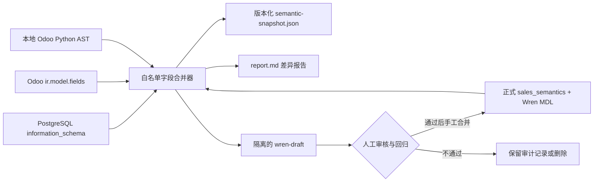

# Odoo 语义同步与一致性审计

> 适用应用版本：0.2.0
>
> 状态：第一阶段已落地
>
> 安全边界：仅读取数据库元数据和本地源码，不读取业务行、不写 Odoo、不自动覆盖正式 Wren MDL

## 1. 背景与目标

Text2SQL 不应依赖模型“猜数据库字段”。本项目现在把销售语义建立在四类可追溯证据上：

1. **PostgreSQL 物理结构**：字段是否真实存在、数据类型、可空性和顺序；
2. **Odoo ORM 元数据**：`ir.model.fields` 中的字段类型、关联模型、标签、帮助、Selection、计算与存储属性；
3. **本地 Odoo 源码**：字段声明位置、`fields.*` 类型、`relation`、`compute`、`store`、`related` 等静态信息；
4. **正式语义层**：当前销售白名单、指标口径和 Wren MDL。

第一阶段的目标不是把所有源码塞进 Prompt，而是自动发现四者之间的结构漂移，生成一个可检查、可构建、但不会自动生效的 Wren 草稿。这样能减少字段幻觉和人工维护遗漏，同时保留当前 SQL 安全边界。

## 2. 与 RAG 的关系

当前能力属于**受控语义检索与元数据增强**，不是经典向量 RAG：

- 运行审计时读取结构化元数据和匹配到的字段声明；
- 生成 SQL 时仍只给模型当前问题需要的表、字段、指标、关系和少量验证示例；
- 不把完整 Odoo 源码切块、向量化后无差别召回；
- 不把源码函数体或业务数据行写入 Wren MDL。

对 Text2SQL 来说，这比“先上通用源码 RAG”更稳定。真正适合后续检索的内容包括：业务术语、Selection 含义、字段帮助、已验证 SQL、客户/产品实体别名和少量关键计算逻辑。

## 3. 架构与数据流



审计只处理 `sales_semantics.json` 已开放的 9 个模型和字段。它不是全库 Schema 导出器，不会扩大模型的数据可见范围。

## 4. 三类采集器

### 4.1 物理数据库采集

读取：

- `information_schema.columns`；
- `ir_model_fields`；
- `ir_model_fields_selection`；
- 当前事务的 `transaction_read_only`。

数据库连接沿用 `codex_readonly` 和 `default_transaction_read_only=on`。审计不会执行事实表 `SELECT`，不会读取订单、客户、金额或其他业务行。若连接不是只读，审计直接失败。

### 4.2 Odoo 源码采集

使用 Python AST 静态解析本地发行版根目录，包括 `odoo/`、社区 `addons/` 和同级企业 Addons。只解析包含目标 `_name` 或 `_inherit` 的候选文件，并只保留白名单字段的声明元数据。

采集内容：字段类型、关联模型、标签、帮助、`related`、`compute`、`store`、公司依赖、必填、只读、Selection、源文件相对路径与行号。

限制：动态注册、复杂继承合并和运行时修改不一定能从 AST 完整还原，所以数据库 ORM 元数据是运行时事实，源码结果是解释和追溯证据。

### 4.3 正式语义采集

读取：

- `backend/app/bi/sales_semantics.json`；
- `backend/app/bi/wren_project/wren_project.yml`；
- `backend/app/bi/wren_project/models/*/metadata.yml`；
- 正式 Wren `knowledge/`。

正式描述优先于自动提取的帮助文本，避免审计草稿丢失已人工确认的指标口径。

## 5. 产物与版本规则

默认输出目录是项目根目录下的 `.semantic-sync/`，已被 Git 忽略：

```text
.semantic-sync/
├─ latest.json
└─ audits/
   └─ YYYYMMDD-HHMMSS-microseconds-digest/
      ├─ summary.json
      ├─ report.md
      ├─ semantic-snapshot.json
      └─ wren-draft/
         ├─ wren_project.yml
         ├─ relationships.yml
         ├─ models/*/metadata.yml
         └─ knowledge/
```

审计 ID 同时包含时间和内容摘要。`latest.json` 使用临时文件替换，避免页面读到半写入内容。API 只允许单个审计任务并发运行。

正式目录 `backend/app/bi/wren_project/` 在整个流程中只读。草稿不会因生成成功而自动启用。

## 6. 差异级别

| 级别 | 典型代码 | 含义 | 是否使状态变为 `drift` |
| --- | --- | --- | --- |
| error | `physical_column_missing`、`formal_model_missing`、`formal_column_missing` | 正式开放内容与真实结构不一致，可能导致查询失败 | 是 |
| warning | `orm_field_missing`、`wren_type_drift` | 运行时元数据或类型存在需要确认的差异 | 是 |
| info | `source_definition_not_found` | AST 未定位声明，可能来自继承或动态注册 | 否 |

`clean` 表示没有错误和警告，不表示所有字段都能在单个源码声明中定位，也不等同于 Text2SQL 准确率 100%。

审计把 Wren 的 `SMALLINT/INTEGER/BIGINT` 视为兼容整数抽象，把 `VARCHAR/TEXT` 视为兼容字符串抽象；例如正式 MDL 用 `BIGINT` 表达 Odoo ID、物理库实际为 `integer` 时不会制造无意义警告，草稿也会保留已经验证的正式抽象。

## 7. 使用方法

### 7.1 网站

1. 启动本地 Odoo/PostgreSQL 和 Agent；
2. 打开“数据与模型”；
3. 找到“Odoo 语义一致性审计”；
4. 点击“运行只读审计”；
5. 查看状态、差异数量和报告路径；
6. 有错误或警告时，先读 `report.md`，再检查 `semantic-snapshot.json` 和 `wren-draft/`。

### 7.2 API

```powershell
# 运行一次审计
Invoke-RestMethod `
  -Uri 'http://127.0.0.1:8090/api/semantic-audit' `
  -Method Post

# 读取最近一次结果
Invoke-RestMethod `
  -Uri 'http://127.0.0.1:8090/api/semantic-audit/latest'
```

首次运行前，`GET /latest` 返回 `404`。重复点击且已有任务运行时返回 `409`。

## 8. 人工审核与发布流程

草稿进入正式 MDL 前必须完成：

1. 核对所有 error 和 warning；
2. 确认类型差异不是有意的语义转换；
3. 检查自动推导关系是否符合 Odoo 业务语义；
4. 运行 Wren `context build`；
5. 运行全部后端测试和 SQL 安全测试；
6. 用相同模型、思考模式和黄金问题集做 native/Wren A/B；
7. 对比 Strict Accuracy、结果签名、修复率、p50/p95、Token 和 Cost；
8. 仅把已人工确认的最小差异合并到正式 MDL，并提升版本。

不要直接复制整个 draft 覆盖正式目录。自动提取的标签和关系是候选证据，不一定是最适合业务用户的最终定义。

## 9. 配置

| 环境变量 | 默认值 | 说明 |
| --- | --- | --- |
| `ODOO_SOURCE_PATH` | `D:\odoo19e\odoo-19.0+e.20250917`（按当前工作区推导） | 本地 Odoo 发行版根目录 |
| `SEMANTIC_SYNC_OUTPUT_PATH` | `<项目>\.semantic-sync` | 审计产物目录 |
| `WREN_PROJECT_PATH` | 内置正式 Wren 项目 | 被审计的正式 MDL 路径 |

配置自定义路径后需重启 Agent。路径中不得放 API Key、数据库备份或业务导出。

## 10. 验证命令

```powershell
Set-Location D:\odoo19e\odoo-agent

& .\.venv\Scripts\python.exe -m unittest discover -s backend\tests -p 'test_*.py' -v
node --check .\app.js

# 将 <draft-path> 替换为设置页显示的草稿目录
& .\.venv\Scripts\wren.exe context build --path '<draft-path>'
```

## 11. 下一阶段

优先级从高到低：

1. 把审计差异接入黄金问题发布门禁；
2. 增加已验证 SQL 与字段术语的混合检索，保留关键词基线；
3. 增加客户、产品、销售员的实体值检索，解决“名称与 ID”匹配；
4. 对关键 Odoo 计算字段建立人工确认的计算口径卡片；
5. 当验证内容显著增多且关键词召回不足时，再评估 pgvector；
6. 只有真正引入文档向量 RAG 后，再使用 Ragas 评估检索质量。

该顺序的原则是：先让模型看到正确、有限、可审计的证据，再扩大检索范围。
